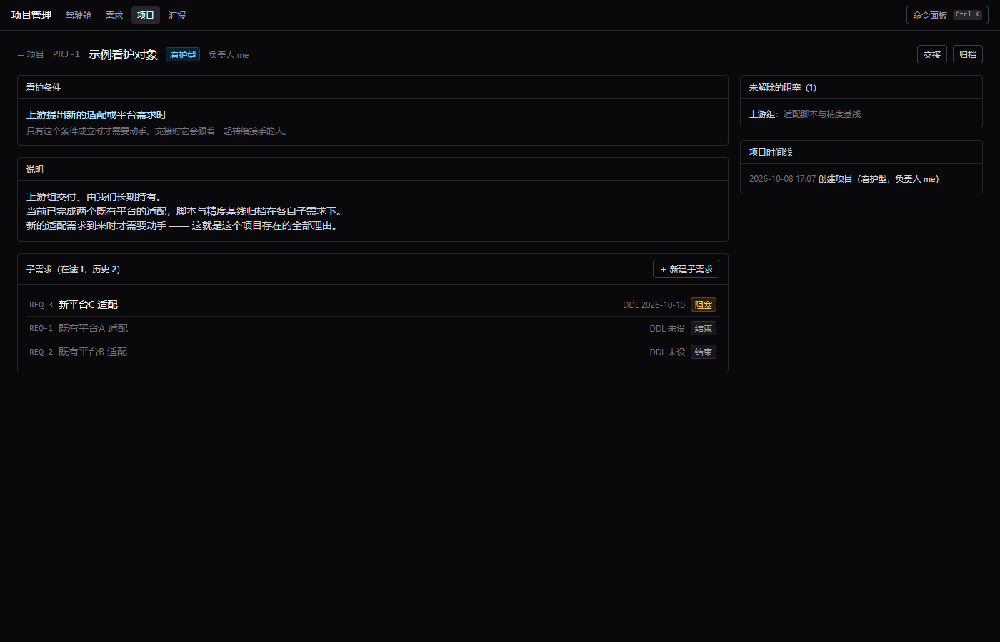

# 本地项目管理系统

管理需求及其各阶段 DDL、零散交付物（文档 / 截图 / 日志），并从事件日志自动生成汇报草稿。

**改代码前先读 [docs/design.md](docs/design.md) 的「核心设计决策」一节** —— 那几条决定了整个数据模型，绕开它们的改动会让汇报功能失效。

## 运行

需要 Node 24+（用到内置的 `node:sqlite` 与 TypeScript 类型剥离，服务端无需构建步骤）和 pnpm。

### 开发模式（前后端分开，带热更新）

```powershell
pnpm install
pnpm dev          # 同时起后端 :5178 和前端 :5173
```

打开 **http://127.0.0.1:5173** —— Vite 会把 `/api` 代理到后端，不用管 CORS。

### 单地址模式（构建前端产物，一个地址搞定）

```powershell
pnpm build        # 构建前端到 web/dist
pnpm start        # 后端会一并托管前端产物
```

打开 **http://127.0.0.1:5178**。这也是日常使用的推荐方式：只有一个进程、一个地址。

- 数据库：`data/manager.db`；上传的文件在 `data/files/`
- **备份 = 复制 `data/` 目录**
- 界面里按 **Ctrl+K** 唤起命令面板

其它命令：

```powershell
pnpm migrate      # 只跑迁移
pnpm test         # 测试（领域层 + HTTP 层）
pnpm typecheck    # shared / server / web 三处类型检查
```

也可以用 `.\start.ps1`，等价于先迁移再起服务。

### 在内网机器上部署

开发在能上外网的环境做，日常在内网用。内网只进不出，所以更新流程是**外面 push、里面 pull**：

```powershell
git pull
pnpm install      # 依赖没变时可跳过
pnpm build        # 前端产物不进版本库，改过前端就必须重建
pnpm start
```

`data/` 不在版本库里，`git pull` 碰不到它 —— 更新代码不会动你的数据。

浏览器打开 **http://127.0.0.1:5178**。

> **注意**：`pnpm install` 和 `pnpm build` 都需要能访问 npm 源。内网如果连 npm 也不通，
> 这一步会失败 —— 那种情况需要先把依赖备好（把 `node_modules/` 一起带过去，
> 或者在内网架一个 npm 镜像）。

## 界面

**驾驶舱**是仪表盘：统计卡片（点一下就跳到对应桶的明细）、三个焦点列表（最紧要 / 需要我去推动 / 我被卡住）、甘特图（横条从创建日到下一个 DDL，逾期段加深，阶段 DDL 是菱形），最后才是七桶明细。

| 驾驶舱 | 需求详情：流水线 / 待办 / 交付物 / 阻塞 / 时间线 |
|---|---|
|  |  |

命令面板（`Ctrl+K`）：输入命令后会先给出「将要执行」的预览。**会失败的情况在这里就能看到**，
不用等按下回车 —— 下面这张图里 `/bump` 因为还有待办没勾完，预览直接写明「执行会被拒绝」：


**看护型项目**：长期持有、事件驱动、要交接出去的责任（比如接手别人的一个已交付项目，只在有新需求时才动）。
它**不进任何时间桶**——它不是一个需求、没有日程；只有触发时在它下面新建的子需求才照常提醒。
交接在对方**确认接手之前**不会从你的驾驶舱消失（免得责任在交接的缝隙里蒸发）：

| 项目详情：看护条件 / 说明 / 子需求 / 交接 | 驾驶舱的「看护中」 |
|---|---|
|  |  |

**全文检索**：搜的是**正文**，不只是标题——你写在备注里的「等测试组排期」、随手加的待办、
交付物文件名、阻塞里等谁等什么、项目的看护条件，都在一个索引里。命中片段高亮，按类别筛选：


命令面板搜不到时会垫一条「在全文里搜「xxx」」（也可以用 `/search <关键词>`）。
索引由 13 个触发器维护，不会过期；`POST /api/search/reindex` 是索引漂了时的对账手段。

**命令面板（Ctrl+K）**：`Tab` 补全。命令名补到 `/todo `，`#REQ` 补到 `#REQ-`（补到第一个不一样的字符），
方向键选中某条后 `Tab` 补全整条。查询期间不报错——`#REQ` 会列出候选而不是骂你「请用编号指明」：


**汇报草稿**：左侧生成与历史，右侧是可编辑的 Markdown。区间自动从「上一次定稿的结束时间」接到现在，
所以「两次汇报之间发生了什么」是一次查询的结果，不靠回忆：


措辞和顺序都能改：编辑 [config/report_templates/default.md](config/report_templates/default.md) 即可，
语法只有 `{{变量}}` / `{{#each}}` / `{{#if}}` / `{{#unless}}` 四种，见[设计文档 §8.2](docs/design.md)。

待办行末尾的 `×` 可以单条删除（带「模板」标记的说明它来自流水线模板）；如果某几条每次都要删，
直接改 `config/pipelines/*.yaml` 里的 `todos` 就不会再生成。

## 目录

| 路径 | 说明 |
|---|---|
| [docs/design.md](docs/design.md) | 设计文档：实体模型、决策与理由、驾驶舱分桶、汇报算法 |
| [config/pipelines/](config/pipelines/) | 流水线模板（SE / 开发两套），改完重启生效 |
| [config/settings.yaml](config/settings.yaml) | 驾驶舱窗口与排序权重 |
| [config/report_templates/](config/report_templates/) | 汇报模板（P2 用） |
| [server/src/db/migrations/](server/src/db/migrations/) | schema 的唯一真相源 |
| [server/src/domain/](server/src/domain/) | 领域逻辑，**事件写入的唯一入口** |
| [web/src/](web/src/) | 前端：驾驶舱、需求列表/详情、搜索、项目、汇报、命令面板 |
| [shared/src/index.ts](shared/src/index.ts) | 前后端共享类型（只导出类型，无运行时代码） |

## 两条硬约定

1. **所有状态变更必须经过 `server/src/domain/`。** 事件表由数据库触发器强制 append-only：改和删会被拒绝，只有写入 `voided_at` 的作废可行。一旦有代码旁路写库，事件日志就不再是完整真相，汇报会开始骗人 —— 这个系统一旦撒谎就没有价值。
2. **已应用的迁移文件不可修改。** 迁移运行器会校验 checksum 并在不匹配时报错；改 schema 请新增 `00N_xxx.sql`。

## 已实现的接口

服务起来后可以直接拿 `curl` / `Invoke-RestMethod` 试。

| 方法 | 路径 | 说明 |
|---|---|---|
| GET | `/api/health` | 存活与已加载的流水线模板 |
| GET | `/api/meta` | 中文标签映射 + 命令面板帮助文本（前端取这里，不重复定义） |
| GET | `/api/pipelines` | 流水线模板全文 |
| GET | `/api/dashboard` | 驾驶舱分桶 + 摘要计数 |
| GET | `/api/items?q=&role=&condition=&includeClosed=` | 需求列表（`condition` 来自 `v_item` 视图） |
| POST | `/api/items` | 新建需求，按角色自动实例化流水线与待办 |
| GET | `/api/items/:id` | 详情：`{item, stages, todos, blockers, deliverables}` |
| PATCH | `/api/items/:id/due` | 设置整体交付 DDL |
| POST | `/api/items/:id/suspend` · `/resume` · `/close` · `/reopen` | 挂起 / 恢复 / 关闭 / 重开 |
| POST | `/api/items/:id/note` | 记一条进展（支持 `occurredAt` 回填） |
| GET | `/api/items/:id/timeline` | 事件时间线（`?includeVoided=true` 含已作废） |
| PATCH | `/api/stages/:id/due` | 设置阶段 DDL（`plannedStart` / `plannedEnd`） |
| POST | `/api/stages/:id/advance` | 推进阶段 `{outcome, forced, reason, closeBlockers}` |
| POST | `/api/stages/:id/suspend` · `/resume` | 阶段级挂起 / 恢复 |
| POST | `/api/todos` · PATCH `/api/todos/:id` | 建待办 / 勾选 |
| POST | `/api/blockers` · PATCH `/api/blockers/:id` | 建阻塞 / 解除 |
| GET | `/api/items/:id/deliverables` | 交付物与版本列表 |
| POST | `/api/deliverables` (multipart) | 新建交付物并上传首个版本 |
| POST | `/api/deliverables/:id/versions` (multipart) | 给已有交付物加版本 |
| PATCH | `/api/deliverables/:id` | 设为 / 取消必交项 |
| GET | `/api/files/:sha256` | 按内容哈希下载 |
| GET | `/api/palette/query?q=` | 命令面板候选 + **人话预览** |
| POST | `/api/palette/execute` | 执行命令（`{input, currentItemId}`） |
| GET | `/api/reports` | 汇报列表 + 可用模板名 |
| POST | `/api/reports/generate` | 生成草稿（区间自动接上一次定稿） |
| GET · PUT · DELETE | `/api/reports/:id` | 读取 / 保存正文 / 删除草稿 |
| POST | `/api/reports/:id/finalize` · `/unfinalize` | 定稿 / 取消定稿 |
| GET | `/api/projects?kind=&includeArchived=` | 项目列表（含子需求数、未解除阻塞数、最近活动） |
| POST | `/api/projects` | 新建项目（看护型必填 `watchFor`） |
| GET | `/api/projects/:id` | 项目详情：说明、子需求、未解除阻塞、最近活动 |
| GET | `/api/projects/:id/timeline` | 项目级事件流 |
| PUT | `/api/projects/:id` | 改名称 / 说明 / 看护条件 / 截止日期 |
| POST | `/api/projects/:id/handoff` | 交接：改负责人 + 把在途子需求、阻塞、看护条件记进事件 |
| POST | `/api/projects/:id/accept` | 接手方确认接手 —— **在这之前它仍留在交出方的看护清单里** |
| POST | `/api/projects/:id/reclaim` | 把责任收回来（没有它，交出去的项目就永远回不来） |
| POST | `/api/projects/:id/archive` · `/unarchive` | 归档 / 取消归档（有在途子需求时拒绝归档） |
| GET | `/api/search?q=&kind=&limit=` | 全文检索（备注 / 待办 / 交付物 / 阻塞 / 项目说明） |
| POST | `/api/search/reindex` | 重建索引（正常用不上，索引漂了时的对账手段） |

## 进度

- [x] **P1 服务端**：schema + 迁移运行器、事件写入服务层、流水线实例化、阶段流转、挂起 / 关闭 / 重开
- [x] **P1 服务端**：驾驶舱七桶分桶与打分、交付物内容寻址上传与版本、需求与阶段 DDL、命令面板、时间线
- [x] **P1 前端**：仪表盘、需求列表与筛选、需求详情、命令面板
- [x] **P2 汇报**：草稿生成（区间自动衔接）、可编辑模板、编辑 / 定稿 / 取消定稿 / 复制
- [x] **P2 项目层**：看护型项目（事件驱动、不进时间桶）、子需求、交接与待接收、收回、归档
- [x] **P2 命令面板**：Tab 补全（命令名 / 需求编号 / 阶段名 / 枚举修饰符）、方向键选择、预览即承诺
- [x] **P2 全文检索**：7 张源表一个索引（FTS5 + trigram）、触发器保证不过期、命中片段高亮、按类别筛选
- [ ] **P3**：git 关联、CLI、docx 导出

## 隐私：真实数据不要进这个仓库

`data/` 已经在 `.gitignore` 里。想在**不碰真实数据**的前提下试东西（演示、截图、演练），
把数据目录指到别处、再换个端口即可：

```powershell
$env:MANAGER_DATA_DIR = 'C:\codes\manager\.scratch-data'
$env:PORT = '5179'
pnpm start
```

`MANAGER_DATA_DIR` 和 `PORT` 都支持环境变量覆盖，`.scratch-data/` 也已加入 `.gitignore`。
