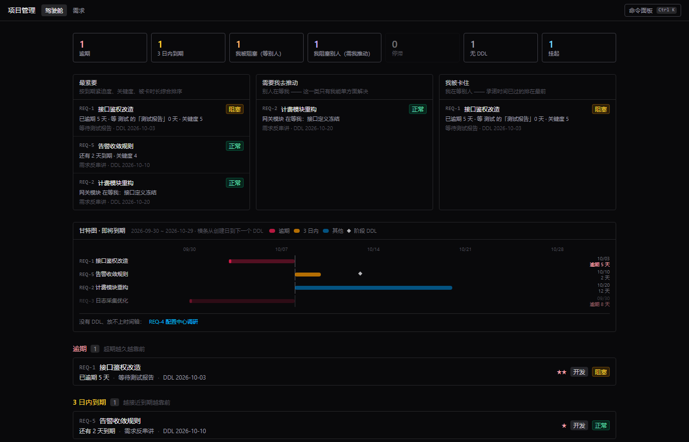
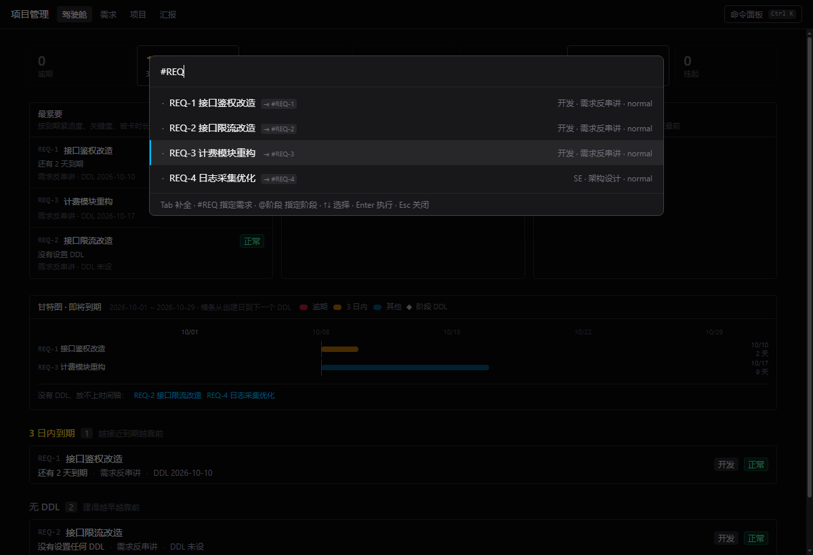
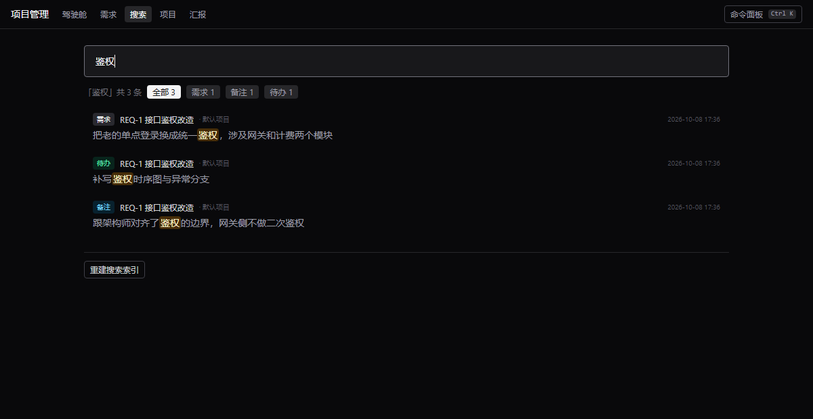
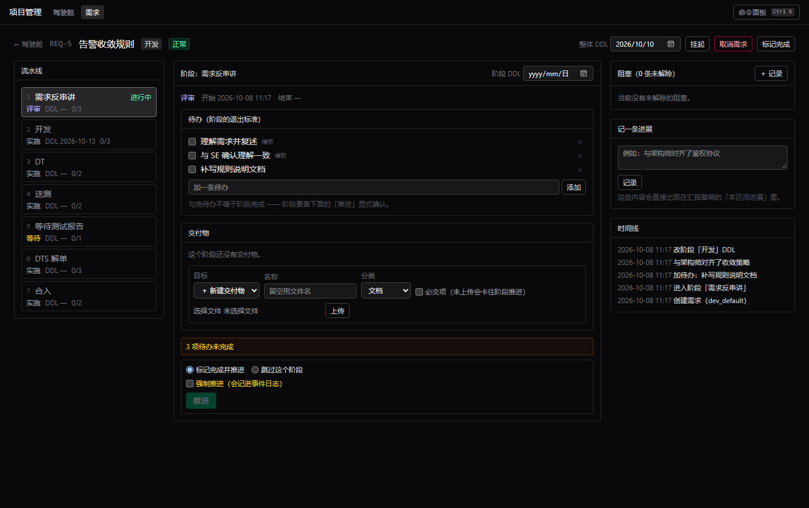
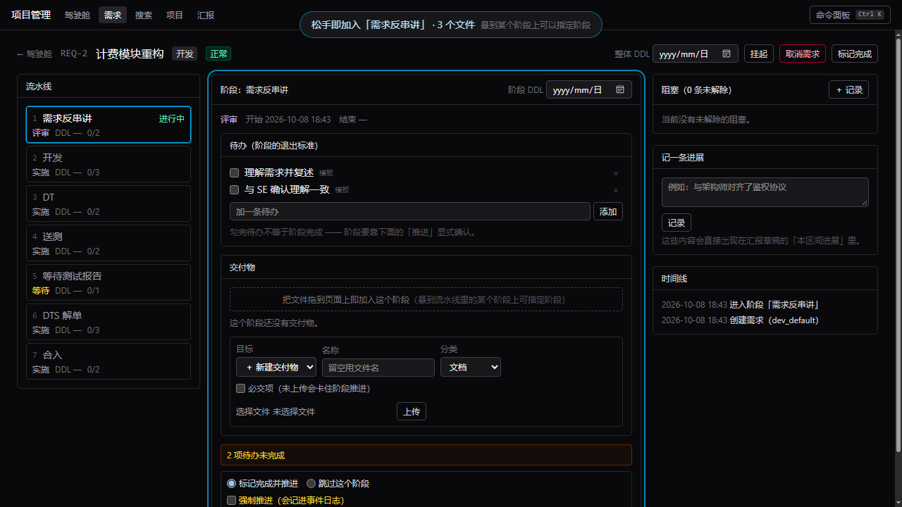
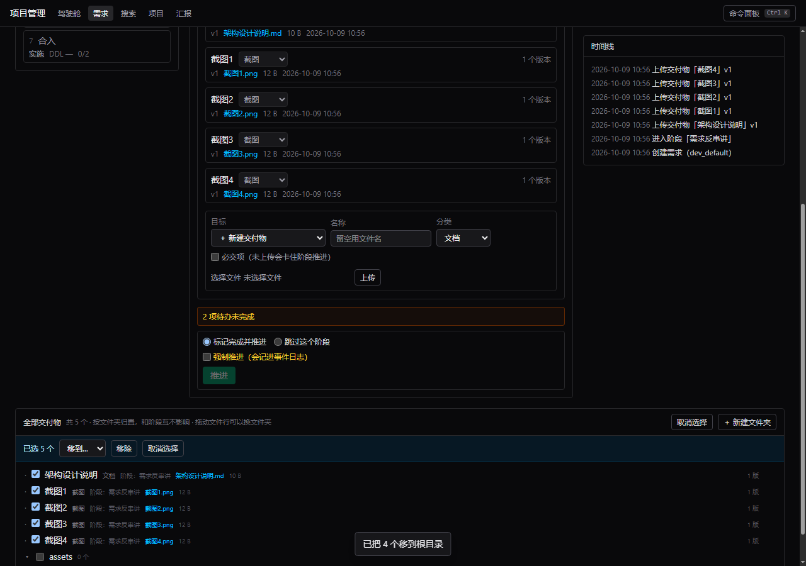
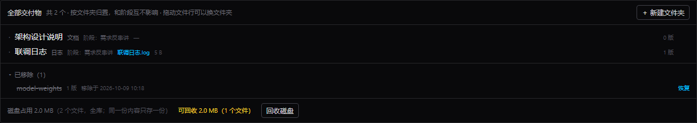
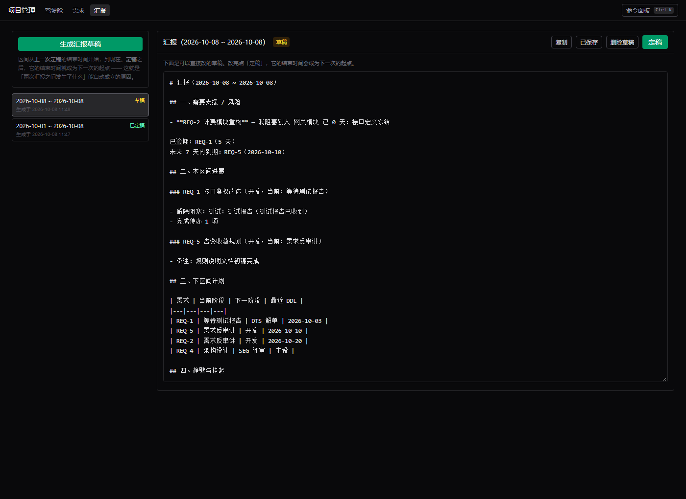
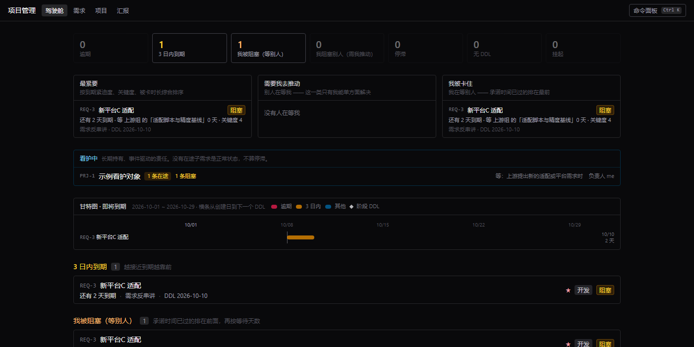

# 本地项目管理系统

管你手上每个需求走到哪一步、下一个 DDL 是什么、零散的交付物放在哪，
并在每次汇报前自动汇总出**「这两次汇报之间我做了什么」**。

数据全在本机的一个 SQLite 文件里：没有账号、没有服务器、不联网。

---

## 快速开始

需要 **Node 24+** 和 **pnpm**。

```powershell
pnpm install
pnpm build
pnpm start
```

打开 **http://127.0.0.1:5178**。也可以用 `.\start.ps1`（等价于先跑数据库迁移再起服务）。

日常更新：

```powershell
git pull
pnpm install     # 依赖没变时可以跳过
pnpm build       # 只有改过前端才需要
pnpm start
```

数据库表结构会在启动时自动升级，**你已有的数据不会丢**。

---

## 它是怎么想这件事的

四条规则决定了界面的样子。理解了这四条，剩下的都是一眼看懂。

### ① 需求沿「流水线」往前走，不在状态之间跳

每个需求从模板实例化出一条阶段流水线，**同一时刻只有一个当前阶段**：

| 角色 | 流水线 |
|---|---|
| SE | 架构设计 → SEG 评审 → TMG 评审 → 需求串讲 → 开发进度跟踪 → 收尾关闭 |
| 开发 | 需求反串讲 → 开发 → DT → 送测 → 等待测试报告 → DTS 解单 → 合入 |

推进阶段是唯一的前进方式。模板在 `config/pipelines/*.yaml`，可以自己改。

### ② 状态是算出来的，不需要你设

你找不到「把状态改成阻塞」这个操作 —— 因为没有这个字段。状态是从事实推出来的：

| 你看到的 | 它其实是 |
|---|---|
| **阻塞** | 有一条未解除的阻塞 |
| **挂起** | `suspended_at` 有值 |
| **结束** | `closed_at` 有值 |
| **正常** | 以上都没有 |

所以：**建一条阻塞，需求就变阻塞；解除它，自动恢复。** 没有两处要同步，也就不会互相矛盾。

### ③ 待办挂在阶段上，勾完才能推进

新建需求时**选的是流水线**（不是角色）—— 内置三条：

| 流水线 | 用在什么上 |
|---|---|
| **SE 默认** | 架构设计 → SEG 评审 → TMG 评审 → 需求串讲 → 开发进度跟踪 → 收尾关闭 |
| **开发默认** | 需求反串讲 → 开发 → DT → 送测 → 等待测试报告 → DTS 解单 → 合入 |
| **看护维护** | 定位 → 修复 → 验证 → 合入（给「长期看护、平时只有零星 bug」的东西用，见下面的看护型项目） |

模板在 `config/pipelines/*.yaml`，可以自己加、自己改，改完重启生效。
（计划里还会有一个在界面上定制流水线的页面 —— 流水线是配置，不该每次都改文件。）

模板会带一批样板待办（界面上标着「模板」）。用不上的单条 `×` 删掉；如果某几条你**每次都删**，
直接改 `config/pipelines/*.yaml` 里的 `todos`，以后就不会再生成。

待办没勾完也能强推，但会被要求写明原因 —— 这个原因会进事件日志。

### ④ 进度不是手填的，是事件攒出来的

记一条进展、推进一个阶段、上传一个交付物、解除一个阻塞 —— 每一次动作都写一条**事件**。

汇报草稿就是「把某个区间内的事件翻译成人话」。所以它不需要你回忆，也不会和事实不一致。

---

### ⑤ 编号是可选的，也可以是任何东西

编号的唯一作用是**一个你能记住、说得出、打得快的短标识**。

所以它**可以没有**。预研、算法看护这类项目本来就没有外部单号 —— 硬编一个 `REQ-6`
等于凭空造了一个你必须记住的映射，比没有标识更糟，因为它**看起来**像个标识。

- 建的时候**留空就没有编号**，界面上只显示标题（系统不会替你编一个）
- 想自己起个短名也行，中文也可以：`量化-平台A`。不能带空格 —— 它要用在 `#引用` 里，空格会把引用切断
- **后来拿到真单号了再补上也来得及**：点标题旁边那个「＋ 编号」。
  「这个方向当时是预研，后来立了项」会留在时间线上

**没有编号不会让你少任何能力**：`#` 引用同时匹配编号和标题，所以 `#量化` 就能找到「模型量化预研」；
全文检索、列表搜索也都搜标题。

## 每天怎么用

1. **新建需求** —— 选角色（SE / 开发），流水线和第一批待办自动铺好
2. **设 DDL** —— 整体交付日期，或某一阶段的日期
3. **干活** —— 勾待办、记进展、上传交付物
4. **卡住了** —— 建一条阻塞，写清「等谁、等什么」，需求自动进入「我被阻塞」桶
5. **推进阶段** —— 待办勾完 → 推进 → 进入下一阶段
6. **汇报** —— 打开「汇报」，生成草稿，改完定稿

最省事的做法是全部用命令面板（下面有速查表），手不离键盘。

---

## 驾驶舱

打开就是仪表盘：统计卡片（点一下跳到对应明细）、三个焦点列表、甘特图，最后是七个桶。



七个桶**互相独立**，一个需求可以同时在多个桶里（比如既逾期又被阻塞）：

| 桶 | 含义 | 窗口 |
|---|---|---|
| 逾期 | 下一个 DDL 已经过了 | — |
| 3 日内到期 | 快到了 | `due_soon_days: 3` |
| 我被阻塞（等别人） | 我在等别人 —— 这类事你自己使劲也没用 | — |
| 我阻塞别人（需我推动） | 别人在等我 | — |
| 停滞 | 很久没有任何事件 | `stale_days: 7` |
| 无 DDL | 还没设日期 —— **不是为了催你，是防止你真的忘了** | — |
| 挂起 | 你主动停掉的，不算逾期也不算停滞 | — |

窗口天数在 `config/settings.yaml` 里改，重启生效。

三个焦点列表按紧迫度打分排序（权重也在 `settings.yaml` 里）：

- **最紧要** —— 按到期紧迫度、关键度、被卡时长综合
- **需要我去推动** —— 别人在等我，这一类只有我能单方面解决
- **我被卡住** —— 我在等别人，承诺时间已过的排最前

**挂起需求会从所有桶里退出**（除了「挂起」桶），也不进焦点列表 —— 这是「别催我」开关。

---

## 命令面板（Ctrl+K）

界面里按 **Ctrl+K**。输入时会先显示**「将要执行什么」的预览**：


预览不是猜的 —— 它和执行用的是同一个计划对象。所以**会失败的情况在这里就能看到**，
不用等按下回车（上图里 `/bump` 因为待办没勾完，预览直接写明「执行会被拒绝」）。

### 语法速查

| 命令 | 干什么 |
|---|---|
| `/todo <文本> [#REQ-1] [@阶段] [due:3d]` | 给需求加一条待办 |
| `/log <文本> [#REQ-1]` | 记一条进展（写进时间线） |
| `/bump [#REQ-1] [@阶段] [outcome:skipped] [reason:原因] [force:true]` | 推进阶段 |
| `/ddl [#REQ-1] [@阶段] <2026-03-05\|3d\|today>` | 设需求整体或某阶段的 DDL（不带 `@` 就是整体） |
| `/suspend [#REQ-1] [@阶段] <原因>` | 挂起（不带 `@` 就是整个需求） |
| `/resume [#REQ-1] [@阶段]` | 恢复 |
| `/close [#REQ-1] done\|cancelled` | 关闭需求 |
| `/block [#REQ-1] to:<对方> need:<等什么> [dir:blocked\|blocking] [sev:high] [promise:3d]` | 记一条阻塞 |
| `/unblock <阻塞ID> [解除说明]` | 解除阻塞 |
| `/search <关键词>` | 全文检索 |
| `/report` | 生成汇报草稿 |
| `/help` | 列出所有命令 |

三个语法要素：

- `#REQ-1` 指定需求。**也可以用标题**：`#量化` 就能找到「模型量化预研」（没编号的需求只能这么引用）
- `@开发` 指定阶段（**不带就用当前进行中的阶段**）
- `key:value` 是修饰符，值里有空格就用引号：`to:"隔壁模块 张三"`

### 几个顺手的细节

**`Tab` 补全。** 命令名补到 `/todo `，引用补到第一个不一样的地方（`#REQ` → `#REQ-`）；
按方向键选中某条后 `Tab` 补全整条。正在挑候选时**不会报错**——`#REQ` 会列出候选，而不是骂你「请用编号指明」：



**相对日期。** `due:3d` 是三天后，还有 `today`、`7d`，或者直接写 `2026-03-05`。

**`>REQ-1` 是精确跳转**，不猜，找不到就明确报错。

**搜不到时垫一条「在全文里搜」** —— 面板只搜标题，正文里的东西（备注、待办、交付物）走全文检索。

---

## 全文检索

搜的是**正文**，不只是标题：写在备注里的「等测试组排期」、随手加的待办、交付物文件名、
阻塞里等谁等什么、项目的看护条件 —— 都在一个索引里。命中片段高亮，可以按类别筛选。



索引是数据库触发器维护的，你写什么它就索引什么，不会过期。

---

## 需求详情

流水线、待办、交付物、阻塞、时间线都在这一个页面上：



**交付物**是内容寻址的：同一份文件重复上传只存一份，每个交付物可以有多个版本，
旧版本不会丢。必交项可以设成**阶段卡点** —— 没上传就不让推进阶段（除非强制跳过并写原因）。

**拖进来就加入。** 不用先想名字和类别，直接把文件拖到页面上：

- **名字**取文件名去掉扩展名（`送测申请单.docx` → 「送测申请单」），原始文件名留着，下载时还原
- **类别**按扩展名猜（`.png` → 截图，`.log` → 日志，`.md`/`.docx` → 文档），猜错了在旁边的下拉框改
- **同名归到同一条**：再拖一次同一个文件名，是它的**新版本**，而不是又建一条
- **内容没变就跳过**，不会造出一个没有意义的 v2
- 想指定阶段，把文件**悬到左边流水线的某个阶段上**再松手



一次可以拖多个文件，落点是你正在看的那个阶段。

### 需求级的文件树

交付物天然是「跟着阶段走」的，但**归置**是你自己的事。页面底部有一棵需求级的文件树：
所有交付物都在这里，按文件夹摆，和阶段互不影响 —— 每行会标出它属于哪个阶段，仅此而已。


- **新建文件夹**（可以嵌套）。空文件夹会保留下来 —— 「我先建个 assets，等下往里放截图」是正常用法
- **拖动文件行**就能换文件夹；拖到面板空白处就是移回根目录
- **勾选后批量处理**：文件夹行的勾选框一次选中它里面的所有东西（含子文件夹），
  然后用「移到…」把整批挪走，或者一次全移除
- 双击文件夹名或文件名可以直接改名（拖进来的名字是从文件名来的，`QQ图片20261008` 这种得能改）
- 删除文件夹时，**里面有东西就直接拒绝**并告诉你有几个 —— 自动把内容挪到上一级看着方便，但「我删了个文件夹，结果 30 个截图散到根目录了」更让人恼火



「我建错了一个文件夹，想把 30 个截图挪出来」就是为批量做的 —— 一个个拖是没法用的。
**整个批次是一个事务**：要么全成，要么全不成。半截生效比失败更让人困惑，
你以为都成功了，实际只动了一半，还得自己找是哪一半。

> **阶段和文件夹是两个正交的轴。** 阶段是这份东西**在流程里的位置**（决定阶段卡点，由流水线推进）；
> 文件夹是**你怎么归置**（随时可改，不影响任何流程判断）。所以把截图拖进 `assets/` 不会让它脱离当前阶段。

### 传错了怎么办

**移除和回收是两步**，这是刻意的 —— **记录**和**文件字节**是两件事：



1. **移除**：交付物从各处消失（列表、文件树、阶段卡点、全文索引），但**磁盘上的文件还在**。
   它掉到「已移除」里，随时可以恢复。这一步是「我不想看见它了」。
2. **回收磁盘**：把没有任何在册交付物引用的文件真正删掉。**这一步不可撤销**，
   被回收的历史版本文件也找不回来（事件日志不受影响，历史记录仍在）。

面板底部一直显示**磁盘占用**和**可回收**多少，所以「谁在占地方」随时看得到；
文件树里每行都标着体积，误传的那个大文件一眼就能找出来。

**上传有体积上限**（默认 512 MB，在 `config/settings.yaml` 的 `upload.max_request_mb`）。
这个系统从第一天就是放文档、截图、日志的 —— 上百 G 的模型包放共享盘，然后在需求的「链接」里加个入口。
（顺带一提：这个上限也不只是为了定位。multipart 解析会把整个请求读进内存，**不设上限就是等着 OOM**。）

### 链接

内部 wiki、设计稿、看板之类的入口可以挂在需求上，点标题直接在新标签页打开：

右栏的「链接」面板，「＋ 加链接」填网址和标题（标题留空就从网址里凑一个）。
只收 `http://` / `https://` 的完整网址 —— 这既是防手滑，也是挡掉 `javascript:` 这类能当代码执行的 URL。

链接也会进全文索引：搜 wiki 页名能找到记过它的那条需求。

---

## 汇报草稿

左边是历史和「生成」按钮，右边是可编辑的 Markdown：



**区间自动衔接。** 生成时的起点 = 上一次**定稿**的结束时间。所以第二次汇报里
**只有两次之间的新动作**，之前那些不会重复出现。

**定稿之后就锁住了**（不能再改、不能删），要改得先「取消定稿」。定稿的结束时间就是下一次的起点。

措辞和顺序都能改 —— 编辑 `config/report_templates/default.md`。
语法只有四种：`{{变量}}`、`{{#each}}`、`{{#if}}`、`{{#unless}}`，
可用变量见[设计文档 §8.2](docs/design.md)。

---

## 看护型项目

有些责任不是「有日程的交付」，而是**长期持有、事件驱动、将来要交出去**的。
比如接手别人的一个已交付项目，只在有新平台需求时才动一次。

这类建**看护型项目**：它**不进任何时间桶**（它不是一个需求、没有日程），
只在驾驶舱的「看护中」里安静地列着。触发时在它下面新建一条子需求 ——
子需求通常走**「看护维护」流水线**（定位 → 修复 → 验证 → 合入），
有 DDL 就照常进临期/逾期桶。

> 典型场景：算法团队把一个模型量化项目交给我们看护，平时不动，只有算法侧报 bug 时要处理。
> 把「模型量化」建成一个看护型项目（看护条件写「算法侧报 bug 时」），每报一个 bug 就在它下面
> 建一条维护需求 —— 这样**容器是长期的、子需求是一次性的**，历史自然按容器归拢。



**看护条件**是必填的（「等什么会触发下一次动作」）—— 那是接手的人唯一必须知道的事。

**交接**是项目级动作。它会自动把「在途子需求 + 未解除的阻塞 + 看护条件」记进事件日志，
接手的人查得到自己接了什么。

而且：**对方确认接手之前，它不会从你的驾驶舱消失**，只是标注「已交出，等 XX 接收」。
免得责任在交接的缝隙里蒸发 —— 它的触发条件可能一年后才成立，到那时没人记得还有这回事。


---

## 数据在哪、怎么备份

| | |
|---|---|
| 数据库 | `data/manager.db`（SQLite） |
| 上传的文件 | `data/files/`（按内容哈希命名） |
| **备份** | **复制整个 `data/` 目录**，没有别的 |

`data/` 不在版本库里，`git pull` 碰不到它。想在不碰真实数据的前提下试东西，
可以换个数据目录和端口启动（见 [docs/development.md](docs/development.md)）。

---

## 在内网机器上部署

如果开发在外网、日常在内网用（内网只进不出），更新流程就是**外面 push、里面 pull**：

```powershell
git pull
pnpm install      # 依赖没变时可跳过
pnpm build        # 前端产物不进版本库，改过前端就必须重建
pnpm start
```

`data/` 不在版本库里，更新代码不会动你的数据。

> **注意**：`pnpm install` 和 `pnpm build` 需要能访问 npm 源。内网如果连 npm 也不通，
> 这一步会失败 —— 那种情况需要先把依赖备好（把 `node_modules/` 一起带过去，
> 或者在内网架一个 npm 镜像）。

---

## 想改这个系统

见 [docs/development.md](docs/development.md)（目录结构、接口、开发模式、约定）
和 [docs/design.md](docs/design.md)（**改代码前必读**：实体模型、决策与理由）。

`config/` 下的流水线、窗口参数、汇报模板都是给人手改的，不用碰代码。

MIT License。
