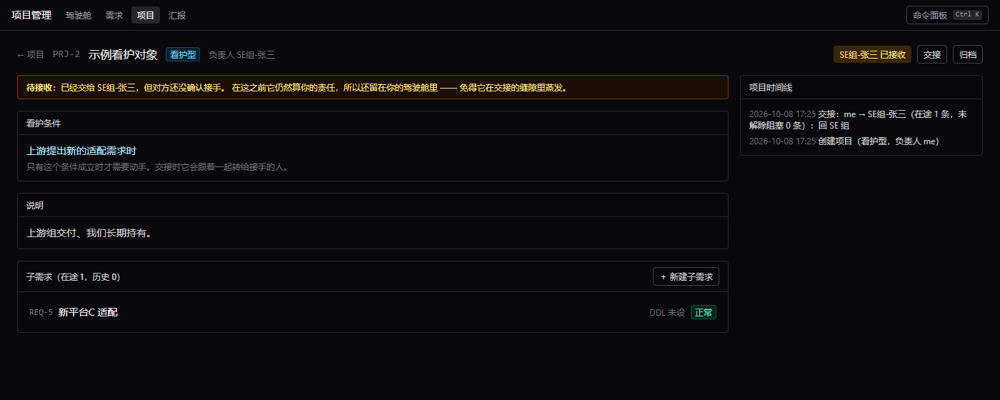

# 本地项目管理系统 · 设计文档

> 状态：草案 v0.1 · 待评审
> 定位：单机、单人使用的项目管理工具，管理需求及其各阶段 DDL、零散交付物，并自动生成汇报草稿。

---

## 1. 目标与非目标

### 1.1 目标

| # | 目标 | 说明 |
|---|---|---|
| G1 | 管理需求及其阶段 DDL | 以「需求」为原子单元，每个需求按角色实例化一条流水线，每个阶段有自己的计划起止时间 |
| G2 | 管理零散交付物 | 文档、截图、日志、评审记录等上传入库；代码仍由 git 管理，本系统只做引用 |
| G3 | 进度可信 | 阶段推进显式确认，实际时间由事件推导，不手填 |
| G4 | 阻塞可见 | 「我被阻塞」与「我阻塞别人」两个方向分开呈现 |
| G5 | 自动排序 | 驾驶舱分桶 + 桶内打分，一眼看出该先干什么 |
| G6 | 汇报草稿 | 一键生成"两次汇报之间发生了什么"的结构化草稿，可编辑留档 |
| G7 | 轻语法操作 | 全局命令面板，键盘驱动，可跳转、可快速记录 |

### 1.2 非目标（明确不做）

- **不做多人协同编辑**。单人使用，唯一的对外协作边界是「导出汇报」。数据模型保留 `owner` 字段但不做权限。
- **不做代码托管**。git 仓库、分支、提交只作为引用挂到需求上（P3），不读取、不克隆、不代管。
- **不做甘特图 / 资源负载平衡 / 工时统计**。第一版不做，避免滑向"通用 PM 工具"。
- **不做移动端**。

---

## 2. 核心设计决策

这一节记录"为什么这么设计"，后续改动请先读这里。

### D1 · 事件日志是唯一真相源（最重要）

所有状态变更——阶段推进、待办完成、交付物上传、阻塞建立/解除、DDL 调整、手工备注——都在 `event` 表追加一条记录。表只允许插入和"作废"（`voided_at` + 原因），**不允许 UPDATE 和 DELETE**。

**为什么**：汇报需求反过来决定了数据模型。如果"从 A 步推进到 B 步"只体现在某个状态字段里，那么你永远只能知道**现在在哪**，无法回答**两次汇报之间发生了什么**。有了事件表，以下全部变成免费副产品：

- 阶段实际开始/结束时间（由事件推导，不手填——手填的数据一定会烂）
- 汇报区间的进展列表
- 停滞检测（距上次事件的天数）
- 阻塞等待天数
- 任何历史回溯

**代价**：所有状态变更必须走同一条写事件的服务层路径。UI 和 CLI 都必须调用同一套 API，不能有旁路写库。这一条守住，汇报功能几乎是白送的。

### D2 · 状态由事实投影，不枚举（正交三维度）

把「走到哪了」和「走不走得动」彻底分成两件事，并且**不给它们定义状态机**：

| 维度 | 回答的问题 | 怎么表达 |
|---|---|---|
| **位置** | 在流水线的哪个阶段 | `stage.key` / `stage.seq` —— 唯一需要枚举的维度 |
| **进度** | 这个阶段走到哪了 | 事实：`actual_start_at` / `actual_end_at` / `outcome` → 投影出 待开始 / 进行中 / 已结束 |
| **状况** | 当前能不能往前走 | 事实：有没有未解除的 blocker、有没有 `suspended_at`、有没有 `closed_at` → 投影出 正常 / 阻塞 / 挂起 / 结束 |

三个维度里**只有"位置"需要枚举**，因为它来自你手工定义的流水线。进度和状况都是**从事实投影出来的**，不落库、不用枚举值：

- `blocked` **不是一个可以手工设置的值**，它的定义就是"存在一条未解除的 blocker"。所以不可能出现"标着阻塞、却查不出在等谁"的数据不一致——那种不一致会让驾驶舱和汇报一起说谎。
- `closed` = `closed_at IS NOT NULL`，再用 `close_reason`（`done` / `cancelled`）区分"做完"和"取消"。
- `suspended` = 显式写了 `suspended_at`。这是**唯一需要你主动设置**的状况，语义是"我知道它停了，别催我"。
- 多个来源取**并集**，不需要"谁覆盖谁"的规则：需求级挂起 OR 当前阶段挂起 = 挂起；优先级 结束 > 挂起 > 阻塞 > 正常。

**收益**：以后想加"等评审排期""等环境到位"，只是多记一条事实，不改枚举、不改状态机、不迁移历史数据。靠枚举堆状态，改一次就得动一次全系统。

### D3 · 角色决定流水线，模板是数据不是代码

流水线模板存为 YAML 文件（`config/pipelines/*.yaml`），可手工编辑、可复制另存。角色是需求的属性，不是项目的属性（理由见 D4）。

### D4 · 项目层建表但 P1 不暴露

`project` 表和 `item.project_id NOT NULL` 从第一天就有，P1 的 UI 完全不显示项目维度：新建需求自动进入系统的默认项目，列表页按扁平需求列表呈现。

**为什么**：以后要加项目层，成本是"建项目 + 挪需求 + 加筛选器"，纯 UI 工作，零数据迁移。而如果 P1 不建表，将来加层意味着改 schema + 改所有查询 + 数据迁移 + 所有历史事件需要重新归组。

**关键约束**：角色（`item.role`）挂在需求上，不挂项目上。同一项目下不同需求角色可以不同，挂需求上天然兼容。

> **后续**：§13 的看护型项目就是当初预留这一层要装的场景。默认项目仍然是隐形的（`is_default = 1`，不出现在项目列表里），只有显式建的项目才露出来。

### D5 · 阶段完成必须显式确认

待办清单（todo）是阶段的**退出标准**，但勾完 todo ≠ 阶段完成。全部勾完时界面提示"可以推进了"，你手动点确认；未勾完也允许推进，但必须写一句原因（原因进事件日志）。

**为什么**：todo 清单永远会漏建、会被临时加项，自动推导出的进度在汇报时是会骗人的。汇报数据一旦不可信，整个系统的价值就没了。骨架是"推进"这个动作，不是勾选框。

### D6 · 阻塞是一等实体，不是状态旗标

`blocker` 独立成表，带方向、对方、需要什么、起始时间、对方承诺时间。

**为什么**：主管关心的是"当前遇到什么问题、需要什么支援"——这句话的完整信息正好就在这张表里。它能被查询、能算等待天数、能生成汇报的第一段。如果只是给需求打一个"阻塞"标记，这些全做不到。

另外，`kind='wait'` 的阶段（如"等待测试报告"）在进入时**自动创建**一条 `direction=blocked_by_others` 的阻塞，不需要你手动建单。

### D7 · 交付物分"必交"与"过程材料"，文件内容寻址存储

- 必交项（如 SEG 评审记录）可设为阶段卡点：未上传不允许推进，但允许强制跳过并记录原因。
- 过程材料（截图、日志）自由上传，不做卡点。
- 文件本体按 `sha256` 内容寻址落盘（自动去重），数据库只存元数据。

**为什么**：整个系统 = 一个文件夹（`data/manager.db` + `data/files/` + `config/`），备份等于复制文件夹。

### D8 · 命令面板与 CLI 共用同一套语法解析

后端提供统一的 `/api/palette/query` 和 `/api/palette/execute`，前端命令面板和未来的 CLI 都调用它，不在前端实现语法解析。

**为什么**：避免两套语法实现漂移；未来加 CLI 时零成本复用；所有操作强制经过服务层，保证 D1 的事件不被绕过。

---

## 3. 领域模型

### 3.1 实体关系

```
project 项目                     容器：如「2026H1 XX版本」（P1 只保留默认项目，UI 不暴露）
└─ item 需求                     被跟踪的原子单元
   │                            状况 .condition 由下方事实投影得出，不落库（D2）
   │                            结束：item.closed_at + close_reason
   │                            挂起：item.suspended_at
   ├─ stage 阶段                 流水线节点（由角色模板实例化）
   │  │                          进度由 actual_start/end_at + outcome 投影得出
   │  │                          挂起：stage.suspended_at
   │  └─ todo 待办               阶段的退出标准
   ├─ deliverable 交付物          绑定 item(+stage)，含多个版本
   │  └─ deliverable_version     一次上传 = 一个版本
   ├─ blocker 阻塞                必绑 item，可选绑 stage；blocked 状况由它派生
   └─ event 事件                  append-only 时间线（横切所有实体）
report 汇报                       一次快照，记录区间 [period_start, period_end)
```

### 3.2 关键字段

#### item（需求）

| 字段 | 类型 | 说明 |
|---|---|---|
| `code` | TEXT UNIQUE | 人类可读编号，如 `REQ-123`。命令面板跳转、CLI 都靠它 |
| `project_id` | FK | P1 恒为默认项目 |
| `title` / `description` | TEXT | 描述支持 Markdown |
| `role` | TEXT | `se` / `dev` / `maint`。**决定流水线模板**（只有真的有模板的角色才留在这儿，见 §5.2） |
| `criticality` | INT 1–5 | 关键度，参与排序打分 |
| `due_at` | DATE NULL | 需求整体交付 DDL |
| `suspended_at` / `suspended_reason` | TEXT NULL | 需求级挂起（跨越阶段，如资源被抽走、待重新排期） |
| `closed_at` | TEXT NULL | 终态时间；非空即结束 |
| `close_reason` | TEXT NULL | `done` / `cancelled`，仅结束时填写 |
| `priority_override` | INT NULL | 手动置顶/置底，**永远覆盖自动排序** |
| `owner` | TEXT | 预留，P1 恒为 `me` |

**注意：没有 `status` 字段。** 需求的状况是投影出来的（见 D2）：

```
condition = closed      若 closed_at 非空
          = suspended   否则若 需求级挂起 或 当前阶段挂起
          = blocked     否则若 存在未解除的 blocked_by_others 阻塞
          = normal      其余
```

这样同一个需求可以同时"逾期"且"被阻塞"，两个视图都能看到它，不需要在枚举里二选一。

> 顺带一个好处：挂起天然就是"别催我"开关——挂起的需求不进逾期/临期/停滞桶，但驾驶舱会单独列出它、并显示挂了多久，免得挂到天荒地老。

#### stage（阶段）

| 字段 | 说明 |
|---|---|
| `seq` | 顺序 |
| `key` | 模板槽位标识，如 `seg_review`。事件 payload 引用它 |
| `name` | 显示名，可改 |
| `kind` | `work` / `review` / `wait` / `milestone` |
| `planned_start` / `planned_end` | **阶段 DDL 在这一层** |
| `actual_start_at` / `actual_end_at` | 由事件推导并冗余存储（便于查询），事件仍是真相源。二者投影出 待开始 / 进行中 / 已结束 |
| `outcome` | `completed` / `skipped`，仅结束时填写；`skipped` 时 `skip_reason` 必填 |
| `suspended_at` / `suspended_reason` | 阶段级挂起 |
| `wait_counterparty` / `wait_for` | `kind='wait'` 时必填：等谁、等什么 |

**同样没有 `status` 字段**："当前阶段"的定义就是"已开始且未结束的那个阶段"。

**不变量**：同一需求下最多一个进行中的阶段——由数据库的**部分唯一索引**保证，不靠服务层自觉：

```sql
CREATE UNIQUE INDEX idx_stage_one_active ON stage(item_id)
  WHERE actual_start_at IS NOT NULL AND actual_end_at IS NULL;
```

**推进阶段时的数据卫生**：若离开的阶段还挂着未解除的阻塞，提示并询问是否一并解除——否则那条阻塞会永远留在"我需要支援"列表里，让驾驶舱开始骗人。

**需求的"下一个 DDL"** = `min(未完成阶段的 planned_end, item.due_at)`。这个派生字段是驾驶舱的核心输入。

#### blocker（阻塞）

| 字段 | 说明 |
|---|---|
| `direction` | `blocked_by_others`（我被阻塞）/ `blocking_others`（我阻塞别人） |
| `counterparty` | 对方：人名、团队或模块名 |
| `need` | 需要什么（一句话，直接进汇报） |
| `severity` | `low` / `medium` / `high` |
| `opened_at` / `promised_at` / `closed_at` | 承诺时间过期是汇报里的重点信号 |
| `resolution` | 关闭时填 |
| — | **没有 `status` 字段**，`closed_at IS NULL` 即"未解除" |

`item_id` 必填，`stage_id` 可选（用于显示"卡在哪个阶段"）。

**需求的 `blocked` 状况由本表派生**，但只在 `direction='blocked_by_others'` 时成立：存在未解除的这类记录，需求才是阻塞态。`direction='blocking_others'`（别人在等我）**不算我被阻塞**——那是"我需要给承诺"，进驾驶舱的另一个桶。

#### event（事件）

| 字段 | 说明 |
|---|---|
| `type` | 见下表 |
| `payload` | JSON，结构随 type 而定 |
| `note` | 人工备注 |
| `item_id` / `stage_id` / `deliverable_id` / `blocker_id` | 可空，按需关联 |
| `actor` | P1 恒为 `me` |
| `occurred_at` | 默认 now，允许回填（补记昨天做的事） |
| `voided_at` / `void_reason` | 作废留痕 |

**事件类型**：

| type | 触发时机 | payload 示例 |
|---|---|---|
| `item_created` | 新建需求 | `{code, role, pipeline_key}` |
| `stage_enter` | 阶段开始 | `{stage_key, from_stage_key}` |
| `stage_exit` | 阶段确认完成 | `{stage_key, to_stage_key, outcome, forced, reason?}` |
| `todo_added` / `todo_done` / `todo_reopened` | 待办变更 | `{todo_id, text}` |
| `deliverable_added` | 上传交付物 | `{deliverable_id, version_no, name, sha256}` |
| `blocker_open` / `blocker_close` | 阻塞建立/解除 | `{blocker_id, direction, counterparty, need, resolution?}` |
| `suspend` / `resume` | 挂起/恢复（需求级或阶段级） | `{scope: item\|stage, stage_key?, reason?}` |
| `item_close` / `item_reopen` | 关闭/重开需求 | `{close_reason}` |
| `ddl_change` | 修改 DDL | `{scope, old, new}` |
| `role_change` | 角色变更/切换流水线 | `{old_role, new_role}` |
| `note` | 手工记录的一句话进展 | `{text}` |

#### report（汇报）

| 字段 | 说明 |
|---|---|
| `period_start` / `period_end` | 本次覆盖区间，左闭右开 |
| `generated_md` | 机器初稿，保留用于对比"我改了什么" |
| `content_md` | 你编辑后的定稿 |
| `finalized_at` | 定稿时间；非空即已定稿 |

**核心机制**：保存为 `final` 后，它的 `period_end` 自动成为下次生成的 `period_start`。所以生成汇报只需要一次查询，不需要你回想。

---

### 3.3 编号是可选的

编号的唯一作用是**一个你能记住、说得出、打得快的短标识**。所以它可以是 NULL。

预研 / 算法看护类项目往往没有外部需求单号 —— 它们是上游团队交付过来、我们长期持有的东西。
硬编一个 `REQ-6` 等于凭空造一个你必须记住的映射，**比没有标识更糟，因为它看起来像个标识**。

| | |
|---|---|
| 建的时候 | 留空 = 没有编号。**不再自动生成 `REQ-N`** —— 真实需求本来就有自己的公司单号，自动生成的是第三种编号，谁也对不上 |
| 自己起短名 | 可以是中文（`量化-平台A`）。不能含空格 / `#` / `@`：空格会把 `#引用` 切断，后两个是命令面板的语法 |
| 事后补 | `PATCH /api/items/:id/code`（项目同理）。预研转立项、拿到真单号时补上，写一条 `code_change` 事件 —— 「这个方向当时是预研，后来立了项」留在时间线上 |

#### `ref`：显示用的标识，在 schema 里算好

```sql
ALTER TABLE item ADD COLUMN ref TEXT
  GENERATED ALWAYS AS (CASE WHEN code IS NULL THEN title ELSE code || '  ' || title END) VIRTUAL;
```

用**虚拟生成列**而不是让前端各写各的判断，好处很实在：

- 判断只写一次，改规则只改 schema
- `SELECT *` 自动带上它，连 `v_item`（`SELECT i.*`）都不用改
- **以后新增的查询不会漏掉这个降级逻辑** —— 漏掉才是这类改动最容易出的错
- 改 `code` 之后 `ref` 自动重算（虚拟列每次读都现算）

前端规则：**需要单个字符串的地方用 `ref`；分成「灰色编号 + 亮色标题」两段的地方，
用「有编号才渲染那一段」**。不要自己拼 `code + title` —— 那样每个地方都得记得处理 NULL，
漏一处就会显示出 `null 模型量化预研`。

#### 没编号不会少任何能力

命令面板的 `#引用` 本来就是 `code LIKE ? OR title LIKE ?`，所以 `#量化` 照样能找到
「模型量化预研」；全文索引、列表搜索也搜标题。Tab 补全在没编号时插**标题**
（长，但它是唯一的稳定标识）。

#### 两个实现上的坑

**迁移是一行**：`ALTER TABLE ... ALTER COLUMN ... DROP NOT NULL`。这是 SQLite 3.53 才有的能力，
老版本得走「建新表 → 拷 → 删旧 → 改名」，而 `item` 被 7 张表 + `v_item` 视图 + 一堆触发器引用 ——
那是最危险的一类迁移。**换更老的 SQLite 会让迁移直接失败**，不是静默降级。

`UNIQUE` 保留：SQLite 把 NULL 当作互不相同，所以多行「没有编号」可以并存；但两个一样的编号
仍然会被拦住（而且报的是「已经被 XXX 占了」，不是 `UNIQUE constraint failed`）。

**`rebuildSearchIndex` 里原来写的是 `code || ' ' || title`**，而 SQLite 里 `NULL || ' '` 还是 `NULL` ——
没编号的东西整条索引变成空，也就是**搜不到**。这种 bug 不报错，只是让东西悄悄消失。
增量触发器改用 `ref` 之后，全量重建也必须用 `ref`，两处不一致会导致「重建一次索引，搜索结果就变了」。

---

## 4. 数据库 Schema（SQLite）

```sql
PRAGMA journal_mode = WAL;
PRAGMA foreign_keys = ON;

CREATE TABLE project (
  id            INTEGER PRIMARY KEY,
  code          TEXT NOT NULL UNIQUE,
  name          TEXT NOT NULL,
  description   TEXT,
  due_at        DATE,
  is_default    INTEGER NOT NULL DEFAULT 0,
  archived_at   TEXT,
  created_at    TEXT NOT NULL,
  updated_at    TEXT NOT NULL
);

CREATE TABLE item (
  id                INTEGER PRIMARY KEY,
  code              TEXT NOT NULL UNIQUE,
  project_id        INTEGER NOT NULL REFERENCES project(id),
  title             TEXT NOT NULL,
  description       TEXT,
  role              TEXT NOT NULL,
  criticality       INTEGER NOT NULL DEFAULT 3 CHECK (criticality BETWEEN 1 AND 5),
  due_at            DATE,
  suspended_at      TEXT,              -- 需求级挂起
  suspended_reason  TEXT,
  closed_at         TEXT,              -- 终态：非空即结束
  close_reason      TEXT CHECK (close_reason IN ('done','cancelled')),
  priority_override INTEGER,
  owner             TEXT NOT NULL DEFAULT 'me',
  created_at        TEXT NOT NULL,
  updated_at        TEXT NOT NULL
);
CREATE INDEX idx_item_live ON item(closed_at, suspended_at, due_at);

CREATE TABLE stage (
  id                INTEGER PRIMARY KEY,
  item_id           INTEGER NOT NULL REFERENCES item(id) ON DELETE CASCADE,
  seq               INTEGER NOT NULL,
  key               TEXT NOT NULL,
  name              TEXT NOT NULL,
  kind              TEXT NOT NULL DEFAULT 'work',
  planned_start     DATE,
  planned_end       DATE,
  actual_start_at   TEXT,
  actual_end_at     TEXT,
  outcome           TEXT CHECK (outcome IN ('completed','skipped')),
  skip_reason       TEXT,
  suspended_at      TEXT,              -- 阶段级挂起
  suspended_reason  TEXT,
  wait_counterparty TEXT,
  wait_for          TEXT,
  notes             TEXT,
  created_at        TEXT NOT NULL,
  updated_at        TEXT NOT NULL,
  UNIQUE (item_id, key),
  CHECK (outcome IS NULL OR actual_end_at IS NOT NULL)
);
CREATE INDEX idx_stage_item ON stage(item_id, seq);
-- 不变量：同一 item 下最多一个进行中的阶段，由数据库保证（D2）
CREATE UNIQUE INDEX idx_stage_one_active ON stage(item_id)
  WHERE actual_start_at IS NOT NULL AND actual_end_at IS NULL;

CREATE TABLE todo (
  id          INTEGER PRIMARY KEY,
  item_id     INTEGER NOT NULL REFERENCES item(id) ON DELETE CASCADE,
  stage_id    INTEGER REFERENCES stage(id) ON DELETE CASCADE,
  text        TEXT NOT NULL,
  done        INTEGER NOT NULL DEFAULT 0,
  done_at     TEXT,
  due_at      DATE,
  seq         INTEGER NOT NULL DEFAULT 0,
  source      TEXT NOT NULL DEFAULT 'manual',
  created_at  TEXT NOT NULL
);
CREATE INDEX idx_todo_stage ON todo(stage_id, seq);

CREATE TABLE deliverable (
  id                 INTEGER PRIMARY KEY,
  item_id            INTEGER NOT NULL REFERENCES item(id) ON DELETE CASCADE,
  stage_id           INTEGER REFERENCES stage(id) ON DELETE SET NULL,
  name               TEXT NOT NULL,
  category           TEXT NOT NULL DEFAULT 'other',
  required           INTEGER NOT NULL DEFAULT 0,
  current_version_id INTEGER,
  created_at         TEXT NOT NULL,
  updated_at         TEXT NOT NULL
);
CREATE INDEX idx_deliverable_item ON deliverable(item_id);

CREATE TABLE deliverable_version (
  id           INTEGER PRIMARY KEY,
  deliverable_id INTEGER NOT NULL REFERENCES deliverable(id) ON DELETE CASCADE,
  version_no   INTEGER NOT NULL,
  sha256       TEXT NOT NULL,
  rel_path     TEXT NOT NULL,
  original_filename TEXT NOT NULL,
  size_bytes   INTEGER NOT NULL,
  mime         TEXT,
  note         TEXT,
  uploaded_at  TEXT NOT NULL,
  UNIQUE (deliverable_id, version_no)
);
CREATE INDEX idx_dv_sha ON deliverable_version(sha256);

CREATE TABLE blocker (
  id           INTEGER PRIMARY KEY,
  item_id      INTEGER NOT NULL REFERENCES item(id) ON DELETE CASCADE,
  stage_id     INTEGER REFERENCES stage(id) ON DELETE SET NULL,
  direction    TEXT NOT NULL CHECK (direction IN ('blocked_by_others','blocking_others')),
  counterparty TEXT NOT NULL,
  need         TEXT NOT NULL,
  severity     TEXT NOT NULL DEFAULT 'medium',
  opened_at    TEXT NOT NULL,
  promised_at  DATE,
  closed_at    TEXT,                  -- 非空即已解除（不用 status 枚举）
  resolution   TEXT
);
CREATE INDEX idx_blocker_open ON blocker(direction, closed_at);

-- 需求状况视图：状况不落库，全部从事实投影（D2）
CREATE VIEW v_item AS
SELECT
  i.*,
  (SELECT s.id FROM stage s
    WHERE s.item_id = i.id
      AND s.actual_start_at IS NOT NULL AND s.actual_end_at IS NULL
    LIMIT 1) AS active_stage_id,
  CASE
    WHEN i.closed_at IS NOT NULL THEN 'closed'
    WHEN i.suspended_at IS NOT NULL
      OR EXISTS (SELECT 1 FROM stage s
                  WHERE s.item_id = i.id
                    AND s.actual_start_at IS NOT NULL AND s.actual_end_at IS NULL
                    AND s.suspended_at IS NOT NULL) THEN 'suspended'
    WHEN EXISTS (SELECT 1 FROM blocker b
                  WHERE b.item_id = i.id
                    AND b.direction = 'blocked_by_others'
                    AND b.closed_at IS NULL) THEN 'blocked'
    ELSE 'normal'
  END AS condition
FROM item i;

CREATE TABLE event (
  id             INTEGER PRIMARY KEY,
  type           TEXT NOT NULL,
  item_id        INTEGER REFERENCES item(id) ON DELETE CASCADE,
  stage_id       INTEGER REFERENCES stage(id) ON DELETE SET NULL,
  deliverable_id INTEGER REFERENCES deliverable(id) ON DELETE SET NULL,
  blocker_id     INTEGER REFERENCES blocker(id) ON DELETE SET NULL,
  payload        TEXT,
  note           TEXT,
  actor          TEXT NOT NULL DEFAULT 'me',
  occurred_at    TEXT NOT NULL,
  voided_at      TEXT,
  void_reason    TEXT
);
CREATE INDEX idx_event_time ON event(occurred_at);
CREATE INDEX idx_event_item ON event(item_id, occurred_at);

CREATE TABLE report (
  id            INTEGER PRIMARY KEY,
  title         TEXT NOT NULL,
  period_start  TEXT NOT NULL,
  period_end    TEXT NOT NULL,
  generated_md  TEXT,
  content_md    TEXT,
  finalized_at  TEXT,               -- 定稿时间；非空即已定稿，也是下次区间起点的依据
  template_key  TEXT,
  created_at    TEXT NOT NULL,
  updated_at    TEXT NOT NULL
);

CREATE TABLE pipeline_template (
  id          INTEGER PRIMARY KEY,
  key         TEXT NOT NULL UNIQUE,
  name        TEXT NOT NULL,
  role        TEXT,
  definition  TEXT NOT NULL,   -- YAML 原文
  builtin     INTEGER NOT NULL DEFAULT 0,
  created_at  TEXT NOT NULL,
  updated_at  TEXT NOT NULL
);

CREATE TABLE tag (
  id INTEGER PRIMARY KEY, name TEXT NOT NULL UNIQUE, color TEXT
);
CREATE TABLE item_tag (
  item_id INTEGER NOT NULL REFERENCES item(id) ON DELETE CASCADE,
  tag_id  INTEGER NOT NULL REFERENCES tag(id) ON DELETE CASCADE,
  PRIMARY KEY (item_id, tag_id)
);

CREATE TABLE setting (
  key TEXT PRIMARY KEY, value TEXT NOT NULL, updated_at TEXT NOT NULL
);

-- 全文检索（P2 已实现，见迁移 004 与 §4.1）
-- 【实测结论】必须用 trigram，不能用默认的 unicode61：
--   unicode61 不切分中文，整串中文变成一个 token → "等待测试报告" 搜 "测试" 返回空。
--   trigram 按 3 字符序列索引 → "等待测试报告" 搜 "测试报告" 命中。
-- 但 trigram 的 MATCH 要求查询 >= 3 字符，而中文两字词极常见（评审 / 串讲 / 开发），
-- 所以查询统一走 LIKE '%q%'：trigram 表对 LIKE 有索引优化，短于 3 字符时退化为扫描，结果仍正确。
-- 另：个人尺度（几百 ~ 几万行）下 LIKE 本身就够快，FTS 属于可选优化；
-- 要加就必须按上面的配置加，否则中文搜索是坏的。
CREATE VIRTUAL TABLE search_fts USING fts5(
  kind, ref_id UNINDEXED, title, body, tokenize = 'trigram'
);
```

### 4.1 全文检索的实现（已实现）

**索引**（迁移 `004_search_fts.sql`）：实际列比上面多两个跳转列和一个排序列 ——
`kind, ref_id UNINDEXED, item_id UNINDEXED, project_id UNINDEXED, occurred_at UNINDEXED, title, body`。
`item_id`/`project_id` 让结果能一行 join 出「属于哪条需求」并跳转，不用 N+1 查询。

**7 张源表 → 一个统一索引**，由 13 个触发器维护。用触发器而不是在领域层手动调用，是因为
**索引是可派生的，而派生物就会过期** —— 靠人记得在每次写入后更新，迟早会漏。

| 类别 | 源表 | 检索内容 |
|---|---|---|
| `item` | item | 编号 + 标题 + 说明 |
| `note` | event（note 非空且未作废） | 备注 / 进展 |
| `todo` | todo（**仅 `source='manual'`**） | 待办文本 |
| `blocker` | blocker | 对方 + 需要什么 + 解除说明 |
| `deliverable` | deliverable | 交付物名称 |
| `project` | project（**排除默认项目**） | 说明 + 看护条件 |

**两处主动排除的噪声**：

- **模板待办不进索引**。每条 dev 需求都有「详细设计」「编码」「自验证」这几条样板文字，索引进去以后搜「设计」会被十几条一模一样的行淹没。用户自己敲的待办才是内容。
- **默认项目不进索引**。它对用户是隐形的（`is_default = 1`，UI 从不显示），索引进去只会在结果里冒出一个用户从没见过的「DEFAULT 默认项目」。

**子条目不带父标题**。备注/待办的 `title` 是空的，只有自己的正文参与检索。带上父需求标题看着更"全"，但那意味着一份需求的 20 条待办会因为这需求标题里的一个词而全部命中，全是噪音。

**排序**：标题命中 > 正文命中，然后按发生时间倒序。标题已经在结果行里显示了，所以命中片段优先取正文。

#### 实测数据（`ESCAPE` 那个坑值得单独记一笔）

在 **25,000 行**索引（5000 条需求 + 20000 条备注）上，走完整查询（LIKE + 两个 join + 排序 + 分类计数）：

| 查询 | 耗时 |
|---|---|
| 4 字、唯一命中 | **1 ms** |
| 无命中 | **0 ms** |
| 2 字、极常见（命中 5000 条） | 49 ms |
| 1 字、极常见（命中 25000 条） | 71 ms |

**`ESCAPE` 会静默关掉 trigram 的 LIKE 索引优化**：

```
不带 ESCAPE：MULTI-INDEX OR → SCAN search_fts VIRTUAL TABLE INDEX 0:L5   ← 走索引
带   ESCAPE：                → SCAN search_fts VIRTUAL TABLE INDEX 0:     ← 全表扫
```

代价是唯一命中 1ms → 28ms，无命中 0ms → 29ms，而且**随索引表变大而线性增长**。
所以只有**查询里真的含 `%` `_` `\`** 时才加 `ESCAPE`。日常查询走索引；
极少数要搜字面百分号或下划线的查询退化为扫描 —— 这类查询本来就罕见，正确优先。

（不转义的后果是实打实的：搜「完成率 50%」会变成「以『完成率 50』开头的一切」，搜「a_b」里的 `_` 会匹配任意单字符。所以不能干脆不转义。）

**这个坑在任何文档里都没有**，是实测出来的。改动 `search.ts` 的查询时必须重跑这里的数字。

> **迁移**：从第一天就用编号 SQL 迁移文件 + `schema_migrations` 表管理 schema 变更。这个系统会陪你很多年，"改表靠手写 SQL 且没有记录"迟早出事。

---

## 5. 流水线模板

模板文件放 `config/pipelines/`，可手工编辑。内置三套：

| key | 角色 | 阶段 |
|---|---|---|
| `se_default` | SE | 架构设计 → SEG 评审 → TMG 评审 → 需求串讲 → 开发进度跟踪 → 收尾关闭 |
| `dev_default` | 开发 | 需求反串讲 → 开发 → DT → 送测 → 等待测试报告 → DTS 解单 → 合入 |
| `maint_default` | 维护 | 定位 → 修复 → 验证 → 合入 |

### 5.0 自定义流水线的前端页面（计划中）

**流水线是配置，不是代码**，所以「加一条流程」不该需要改仓库。计划在驾驶舱里做一个定制页面：
可视化地增删阶段、改阶段名与类型、编辑每个阶段的待办清单，保存后写回 `config/pipelines/*.yaml`。

要注意的几点（先记下来，做的时候别踩）：

- **写回 YAML 要保注释**。这个文件是给人读的，直接把对象序列化会把注释全吃掉。
- **改流水线不影响已有需求**。模板只在「建需求那一刻」被实例化成 stage 行；改模板不会回头改历史
  （这是对的，历史不该被重写）。页面上要说清这一点，否则用户会以为改完就生效了。
- **阶段 key 是稳定标识**，改名可以，改 key 要慎重 —— 它出现在事件 payload 里。

现在新建需求时选的是**流水线**而不是角色（见 §5.2），所以页面上新增一条模板，它会自动出现在下拉里。

### 5.2 新建需求时选的是流水线，不是角色

一开始下拉框列的是 `meta.roles`（写死的枚举：SE / 开发 / 测试 / 维护），但只有 SE 和开发有模板 ——
**选「测试」或「维护」点创建，必然报「角色 X 没有对应的流水线模板」**。界面上摆着四个选项，两个必失败。

改成列 `/api/pipelines` 返回的真实模板之后，这个 bug 在结构上不可能再出现：
**列出来的每一条都建得出来**。「维护」角色也随着 `maint_default` 的加入变得可用了。

`createItem` 同时接受 `role` 和 `pipelineKey`；给 key 时以模板为准。测试里有一条
「每一条内置模板都能真的建出需求」，专门盯模板和建需求逻辑不一致的情况。

### 5.3 SE

```yaml
key: se_default
name: SE 默认流水线
role: se
stages:
  - key: arch_design
    name: 架构设计
    kind: work
    todos: [输出架构设计文档, 识别外部依赖与接口]
  - key: seg_review
    name: SEG 评审
    kind: review
    todos: [提交评审材料, SEG 评审通过, 评审意见闭环]
  - key: tmg_review
    name: TMG 评审
    kind: review
    todos: [提交评审材料, TMG 评审通过]
  - key: req_walkthrough
    name: 需求串讲
    kind: review
    todos: [串讲材料准备, 向开发完成串讲, 疑问澄清闭环]
  - key: dev_tracking
    name: 开发进度跟踪
    kind: work
    todos: []
  - key: close
    name: 收尾关闭
    kind: milestone
    todos: [交付物归档]
```

### 5.2 开发

```yaml
key: dev_default
name: 开发默认流水线
role: dev
stages:
  - key: req_reverse_walkthrough
    name: 需求反串讲
    kind: review
    todos: [理解需求并复述, 与 SE 确认理解一致]
  - key: coding
    name: 开发
    kind: work
    todos: [详细设计, 编码, 自验证]
  - key: dt
    name: DT
    kind: work
    todos: [DT 用例执行, 问题单闭环]
  - key: submit_test
    name: 送测
    kind: work
    todos: [送测材料准备, 正式送测]
  - key: wait_test_report
    name: 等待测试报告
    kind: wait
    wait_counterparty: 测试
    wait_for: 测试报告
    todos: [跟踪测试进度]
  - key: dts_fix
    name: DTS 解单
    kind: work
    todos: [问题单分析, 修复并验证, 回归通过]
  - key: merge
    name: 合入
    kind: work
    todos: [代码检视, 合入主干]
```

### 5.3 模板实例化规则

1. 新建需求时选定角色 → 选定模板 → 按 `seq` 生成全部阶段 → 生成各阶段 todo → **首阶段的 `actual_start_at` 置为创建时间**并写 `stage_enter` 事件。（"进行中"是由时间戳投影出来的，没有状态字段可置。）
2. 进入 `kind='wait'` 的阶段时，**自动创建**一条 `direction=blocked_by_others` 的阻塞（`counterparty` / `need` 取阶段配置）；离开该阶段时自动关闭。
3. 角色变更时，询问处理方式：追加新流水线段 / 替换未完成阶段 / 仅切角色不改阶段。已完成的阶段一律保留，变更写入 `role_change` 事件。
4. **模板带来的待办可以单条删掉**——真实的清单总有两三条你用不上，不能让它们一直堆着。删掉行，但留一条 `todo_removed` 事件把原文记下来（D1 的直接推论：事件日志是唯一真相源，删掉的东西在复盘里仍然看得到）。如果某条待办**每次都要删**，那说明模板该改：直接编辑 `config/pipelines/*.yaml` 里的 `todos`，下次新建需求就不会再生成。

---

## 6. 驾驶舱与自动排序

### 6.1 先分桶，再打分

不要指望一个魔法优先级分数——**分桶才是主要价值**，分数只决定桶内顺序。

各桶独立计算，**同一个需求可以同时出现在多个桶里**（一个逾期且被阻塞的需求理应两处都看得到）。

| 桶 | 判定 | 桶内排序依据 |
|---|---|---|
| 逾期 | 下一个 DDL < 今天 | 超期天数 ↓ |
| 3 日内到期 | DDL 在今天 ~ +3 天 | 剩余天数 ↑ |
| **我被阻塞（等别人）** | 存在未解除且 `direction=blocked_by_others` 的阻塞 | 承诺时间已过 → 等待天数 ↓ → 严重度 |
| **我阻塞别人（需我推动）** | 存在未解除且 `direction=blocking_others` 的阻塞 | 对方等待天数 ↓ → 严重度 |
| 停滞 | 距最近事件 > `stale_days`（默认 7） | 停滞天数 ↓ |
| 无 DDL | 无任何 DDL | 创建时间 ↓ |
| 挂起 | `suspended_at` 非空 | 挂起天数 ↓ |

> **除"挂起"外的所有桶都要求需求既未关闭也未挂起。** 挂起就是"别催我"开关；但挂起的需求必须单独列出并显示挂了多久，否则它会挂到天荒地老。
>
> 挂起桶里若这条需求**挂起时就已经逾期**，额外标注 `[挂起 12 天，挂起时已逾期 5 天]`——挂起不能变成藏逾期的地方。
>
> 最后三个桶是"防止悄悄漏掉"的安全网——没有 DDL、长期不动、被自己搁置的需求不会自己浮上来，必须单独列。

### 6.2 桶内打分

```
urgency     = clamp(1 - days_left / horizon, 0, 1)        # horizon 默认 14 天
crit        = (criticality - 1) / 4                        # 0..1
blocker_age = clamp(blocker_days / 14, 0, 1)
downstream  = clamp(dependent_count / 3, 0, 1)             # P3 依赖边启用后生效
stale       = clamp(stale_days / 30, 0, 1)

score = 0.40*urgency + 0.20*crit + 0.20*blocker_age + 0.15*downstream + 0.05*stale
```

权重全部放 `config/settings.yaml`。`item.priority_override` 非空时**永远置顶/置底**，覆盖自动排序——自动排序偶尔会气人，必须留一个手动出口。

### 6.3 仪表盘的组成（`GET /api/dashboard`）

分桶回答「都有哪些」，仪表盘还要回答「现在就动手的话动哪几个」。所以首页由四层构成，口径全部来自同一份事实（`buildFacts`），不各查一遍——否则三处对「逾期几天」的算法迟早会不一致：

| 层 | 内容 |
|---|---|
| 统计卡片 | 七个桶的数量，**每张卡片就是跳到该桶明细的链接**（空桶置灰不可点） |
| 焦点列表 | 各取前 3：**最紧要**（按综合分）、**需要我去推动**（别人在等我，只有我能单方面解决）、**我被卡住**（我在等别人，承诺时间已过的顶到最前） |
| 甘特图 | 一行一个需求，横条从创建日到下一个 DDL；逾期段单独加深标出；未结束阶段的 `planned_end` 画成里程碑菱形 |
| 分桶明细 | §6.1 的七桶列表 |

**焦点列表与分桶的两点差异**：① 焦点各截前 3 条，分桶给全量；② **挂起的需求不进焦点列表**，在甘特图里也排到最后并置灰——这和「挂起退出风险桶」是同一条规则，仪表盘是给你决定先动哪个用的，挂起的东西不该占头几行。

**甘特图窗口**：默认回看一周、前看三周，数据撑得开就撑开，但硬边界是 45 ~ 90 天。没有这个上限，一条「明年 3 月到期」的需求会把整张图压成一根线。窗口外的 DDL 不画，但会报一个数；没有 DDL 的需求另列在图表下方。

---

## 7. 交付物管理

### 7.1 存储布局

```
data/
  manager.db
  files/
    ab/abcdef0123...   # 按 sha256 前两位分片，文件名即 hash
```

上传流程：算 `sha256` → 若文件已存在则复用（去重）→ 否则落盘 → 写 `deliverable_version` → 写 `deliverable_added` 事件。

### 7.2 两类交付物

| 类型 | `required` | 行为 |
|---|---|---|
| 阶段必交项 | 1 | 设为卡点：阶段仍有未上传的必交项时，推进需二次确认并可写原因 |
| 过程材料 | 0 | 自由上传，不影响阶段推进 |

分类枚举：`doc` / `design` / `screenshot` / `log` / `review_record` / `other`。

### 7.3 git 引用（P3）

不托管代码，只记引用：`{repo_url, branch, commit_sha}`，以 `note` 类事件或独立关联表挂在需求上。用途是在需求详情的"相关代码"区和汇报里给出可点击链接。

---

## 8. 汇报草稿生成

### 8.1 生成算法

```
period_start = 最近一个已定稿（finalized_at 非空）的 report.period_end
               若无 → now - 默认区间（默认 7 天）
period_end   = now
events       = SELECT * FROM event
               WHERE occurred_at >= period_start AND occurred_at < period_end
                 AND voided_at IS NULL
```

按需求分组产出四段：

1. **需要支援 / 风险** ← 放最前面，因为主管更关心这个
   - 所有未解除的 `blocked_by_others` 阻塞，按（承诺时间是否已过、等待天数）排序，每条带"等谁、等什么、等了多久"
   - 别人在等我、已经等了很久的（`blocking_others`）
   - **当前所有已逾期的项**——注意不是「本区间新出现的」。拖了三周还没解决的事更不该被藏起来，风险段本身就是现在时。
   - 未来 N 天内的 DDL（N = `dashboard.lookahead_days`）
   - **不含挂起项**——挂起的东西不该出现在"需要支援"里
2. **本区间进展**
   - 阶段迁移：由 `stage_exit` 事件还原，形如 `REQ-123 需求串讲 → 已送测`
   - 交付物上传列表、闭环的阻塞、完成的待办数
   - 有 `note` 事件的原文照录
3. **下区间计划**：每个在途需求的当前阶段、下一阶段、最近 DDL
4. **静默与挂起**：区间内零事件的在途需求（最容易在汇报时被问住的盲区）+ 当前挂起的需求及挂起天数

### 8.2 输出模板

模板文件放 `config/report_templates/*.md`，**可编辑** —— 这样你能按主管的口味调整措辞和顺序，而不用改代码。渲染器是自写的极简实现（`server/src/domain/template.ts`，约一百行），只支持四种标签：

| 写法 | 含义 |
|---|---|
| `{{变量}}` | 插值。数组自动用「、」连接，缺失的变量渲染成空 |
| `{{#each 列表}}…{{/each}}` | 遍历数组；循环体内直接写字段名 |
| `{{#if 变量}}…{{/if}}` | 变量非空时渲染。**空数组、空串、0、false 都算「没有」** |
| `{{#unless 变量}}…{{/unless}}` | 取反 |

两条容易踩的规则，实现里都做了：

- **独占一行的区块标签会连同它那一行一起去掉。** 所以下面这种写法渲染出来两项之间**没有**空行；想要空行就在模板里真的写一个空行。
- **区块标签前后还有别的字符时不当「独占一行」处理**，`前缀 {{#if a}}内容{{/if}} 后缀` 会原样内联。

不做 HTML 转义 —— 输出是 Markdown，转义会把 `&` 和 `<` 弄坏。模板缺变量、标签不闭合、用了不支持的标签，都会**报错并指出是哪一行的问题**，而不是静默渲染出半成品。

可用变量分四段，与 §8.1 的算法一一对应：

| 段 | 变量 |
|---|---|
| 区间 | `period_start` / `period_end`（日期）、`period_start_at` / `period_end_at`（完整时刻）、`generated_at`、`lookahead_days` |
| 一、风险 | `blockers[]`（`item_code` `item_title` `direction_label` `counterparty` `need` `severity` `age_days` `promised_at` `promise_note`）、`overdue_items[]`、`upcoming_items[]`（各含 `code` `title` `days` `next_ddl`） |
| 二、进展 | `items_with_events[]`（`code` `title` `role_label` `current_stage` `transitions[]` `deliverables[]` `closed_blockers[]` `notes[]` `extra[]` `done_todos` `removed_todos`） |
| 三、计划 | `active_items[]`（`code` `title` `current_stage` `next_stage` `next_ddl`） |
| 四、静默挂起 | `silent_items[]`、`suspended_items[]`（各含 `code` `title` `days` `reason`）、`no_quiet_items` |

生成后：`generated_md` 存档机器初稿（用于对比你改了什么），`content_md` 供你编辑；点「定稿」写入 `finalized_at`，其 `period_end` 成为下次区间起点。定稿的汇报不能改也不能删（它是下次区间的起点），要先「取消定稿」；未定稿的草稿可以删。

---

## 9. 轻语法与命令面板

### 9.1 命令面板（Ctrl+K）

后端统一解析（`server/src/domain/palette.ts`），返回候选动作与**人话预览**，前端只负责渲染和触发。

**词法规则**（初稿里 `@对方` 和 `@阶段` 冲突，实现时改掉了，这里以代码为准）：

| 写法 | 含义 |
|---|---|
| `#REQ-123` | 需求（编号或 id）。`#` 永远只表示需求 |
| `@开发` | 阶段（key 或名字）。`@` **永远只表示阶段** |
| `key:value` | 修饰符。值含空格用引号：`to:"隔壁模块 张三"` |
| 其余 | 位置参数，按各命令的约定解释 |

不在该命令修饰符白名单里的 `key:value` 会**退回成普通文本**，所以在 `/log 修复 bug:空指针` 里，正文的冒号不会被吃掉。

```
REQ-123                     模糊搜索需求，回车跳转
>REQ-123                    按编号精确跳转（不猜，找不到就报错）
/todo <文本> [#REQ-1] [@阶段] [due:3d|2026-03-05]
/log <文本> [#REQ-1]         记一条进展（note 事件）
/bump [#REQ-1] [@阶段] [outcome:skipped] [reason:原因] [force:true]
/ddl [#REQ-1] [@阶段] <2026-03-05|3d|today>    不带 @ = 改需求整体 DDL
/suspend [#REQ-1] [@阶段] <原因>               不带 @ = 挂起整个需求
/resume [#REQ-1] [@阶段]
/close [#REQ-1] done|cancelled               必须说清是完成还是取消
/block [#REQ-1] to:<对方> need:<需要什么> [dir:blocked|blocking] [sev:high] [promise:3d]
/unblock <阻塞ID> [解除说明]
/help
/report                                      （P2）
```

不带 `#` 时用「界面当前打开的需求」，不带 `@` 时用「当前进行中的阶段」——`/ddl` 是唯一例外，它不带 `@` 就是改需求整体 DDL，否则整体 DDL 就没法用命令改。

**预览即承诺**：`/api/palette/query` 返回的预览，和 `/api/palette/execute` 执行的是同一个计划对象。所以像 `/bump` 这种会因待办没勾完而被拒的操作，预览里就会提前警告「执行会被拒绝，要强推请加 force:true」，而不是等你按下回车才报错。

`due:3d` 这类相对时间语法直接可用。所有命令执行都走服务层，保证事件必被写入。

#### 9.1.1 Tab 补全

**补的是「正在输入的最后一段」**（以空白分隔）。服务端在 `/api/palette/query` 里一并返回：每个候选的 `insert`（Tab 该把它换成什么），以及一个 `completion` 上下文（`token` + 所有 `insert` 的**最长公共前缀**）。

| 场景 | Tab 行为 |
|---|---|
| 没按过方向键，且公共前缀**能延长**当前这段 | 补到公共前缀。`/to` → `/todo `；`#REQ` → `#REQ-` |
| 没按过方向键，只有唯一候选 | 直接补完。`/re` 之外的 `/to` 一次到位 |
| 按过方向键 | 补全**选中的那一条**的 `insert` |
| 没有 `completion` 上下文（纯搜索） | 整体替换。搜「鉴权」时 Tab 变成 `#REQ-1`，把模糊搜索精确化 |
| 候选没有 `insert`（纯展示） | Tab 不动它 —— 免得把用户敲好的内容冲掉 |

**只有真能延长才动。** 公共前缀可能压根不以当前这段开头：输入 `#接口` 时候选是 `#REQ-1..5`，公共前缀是 `#REQ-` —— 把它填进去等于把用户打的字换成毫不相干的东西。这种情况不动，让用户用方向键挑。这条规则只在客户端。

**`insert` 与 `label` 是两件事。** `label` 给人看（`REQ-1  接口鉴权改造`），`insert` 给机器用（`#REQ-1`）。命令的 `insert` 带一个尾随空格（后面必定还要接参数）。

#### 9.1.2 查询不报错，执行才报错

输入 `#REQ` 时**不该骂人**。「匹配到多个需求，请用编号指明」这种话，候选列表本身就回答了——列出来让你 Tab 就行。

但也不能一刀切地把错都吞掉：「关闭需求必须说清是完成还是取消」说的是**别处**缺东西，候选列表回答不了，必须照实说。

**用候选数量区分**：

- **多个候选** = 你正在挑 → 不报错，只给候选
- **唯一候选** = 这一段其实已经确定了 → 放行到命令规划，把真正的错误或预览照实说出来

（命令名本身没敲完时例外：补全就能解决，此刻报「没有 /to 这个命令」纯属添乱。）

#### 9.1.3 键盘分工

| 键 | 命令模式 | 搜索模式 |
|---|---|---|
| `Tab` | 补全 | 补全 / 把选中项变成精确引用 |
| `Enter` | **执行当前输入**（不是执行选中的候选） | 跳转到选中项；选中命令则执行它 |
| `↑` `↓` | 选择 | 选择 |
| 鼠标点 | 补全（别把正在写的命令冲掉） | 跳转 |
| `Esc` | 关闭 | 关闭 |

命令模式下 `Enter` 必须执行**输入框里的内容**而不是高亮的候选 —— 否则 `/todo 写文档 #REQ` 高亮着 `#REQ-2` 时回车会跳走，草稿就没了。cmdk 的 `onSelect` 分不出回车和鼠标点，所以点的时候先用 `onMouseDown` 记一笔。

### 9.2 CLI（P3）

同一套语法，命令形式：

```
pm log "跟张三对齐了接口协议" -r REQ-123
pm bump REQ-123 送测
pm report --open
pm ls --blocked
```

---

## 10. 技术架构

### 10.1 选型

| 层 | 选型 | 理由 |
|---|---|---|
| 后端 | Node 24 + TypeScript + Hono | 与前端同一套工具链；Hono 的 RPC 模式让前端直接拿到 API 类型，零 codegen |
| 数据库 | `node:sqlite`（Node 内置，SQLite 3.53.4） | 零原生依赖，不用编译 `better-sqlite3`；WAL、FTS5、部分唯一索引实测均可用 |
| 迁移 | 手写编号 `.sql` + `schema_migrations` 表 | 表结构显式可读；不引入 ORM，SQL 本身就是文档 |
| 前端 | React + TypeScript + Vite | 生态成熟 |
| 状态/请求 | TanStack Query | 服务端状态为主，缓存和失效重取省心 |
| 样式 | Tailwind CSS | 快速迭代 |
| 命令面板 | cmdk | 交互细节（键盘导航、模糊匹配）不用自己造 |
| 编辑器 | CodeMirror 6 | 汇报稿编辑 + 键位模型可控 |
| 启动 | `pnpm dev` 同时起 server 与 web，`start.ps1` 打印本地 URL | P1 不做打包 |

**为什么选 Node 而不是 Python**：这个软件真正的复杂度在状态机、事件日志、汇报模板生成，这些跟语言无关——那就选摩擦最小的。前端必然是 TypeScript，后端同语言换来的是：一套工具链、一套依赖管理、前后端类型直接共享。唯一偏向 Python 的是 P3 的 docx 导出，npm 的 `docx` 包够用。

**为什么不做桌面应用**：Electron/Tauri 相对本地 Web 只多了打包、自动更新和体积负担，功能上不多什么；而你要的"快捷键唤起终端"体验用命令面板 + 后续 CLI 即可满足。

### 10.2 目录结构

```
C:\codes\manager\
  docs/design.md
  config/             # 可手工编辑，纳入版本管理
    pipelines/*.yaml
    report_templates/*.md
    settings.yaml
  shared/             # 前后端共享的领域类型
    src/
  server/
    src/
      index.ts        # Hono app 与启动
      db/             # 连接、PRAGMA、迁移运行器、migrations/*.sql
      domain/         # 领域逻辑；事件写入的唯一入口
      routes/         # items, stages, todos, deliverables, blockers, events, reports, palette, dashboard
    tests/
  web/
    src/
      pages/          # Dashboard, Items, ItemDetail, Reports, Settings
      components/
      lib/
  data/               # 运行时数据，不进版本库
    manager.db
    files/
  start.ps1
```

### 10.3 API 草案

```
GET    /api/dashboard                        驾驶舱分桶结果
GET    /api/items?q=&role=&condition=&tag=   列表 + 过滤（condition 来自 v_item）
POST   /api/items                            新建（自动实例化流水线）
GET    /api/items/{id}                        详情（阶段+todo+交付物+阻塞+时间线）
PATCH  /api/items/{id}                        改标题/角色/关键度/DDL
POST   /api/items/{id}/stages/{sid}/advance   {outcome, note?, forced?, close_blockers?} → 写 stage_exit/enter
POST   /api/items/{id}/suspend                {reason?, stage_id?} → 挂起需求或某阶段
POST   /api/items/{id}/resume                 {stage_id?}
POST   /api/items/{id}/close                  {reason: done|cancelled} → 写 item_close
POST   /api/items/{id}/reopen
POST   /api/items/{id}/todos                  建待办
PATCH  /api/todos/{id}                        {done} → 写 todo_done
POST   /api/blockers                          建阻塞 → 写 blocker_open
PATCH  /api/blockers/{id}                     解除 → 写 blocker_close
POST   /api/deliverables                      multipart 上传（含版本）
GET    /api/files/{sha256}                    下载
GET    /api/items/{id}/timeline               事件流
POST   /api/events                            手工补记（note，支持 occurred_at 回填）
POST   /api/reports/generate                  生成草稿
PUT    /api/reports/{id}                      保存/定稿
GET    /api/search?q=                         全文检索
GET    /api/palette/query?q=                  命令面板：返回候选动作
POST   /api/palette/execute                   执行动作
GET/PUT /api/settings, /api/pipelines
```

### 10.4 页面

| 页面 | 路径 | 内容 |
|---|---|---|
| 驾驶舱（首页） | `#/` | 统计卡片（可点击跳桶）→ 三个焦点列表 → 看护中（仅看护型项目）→ 甘特图 → 七桶明细，见 §6.3 |
| 项目列表 | `#/projects` | 新建项目（选类型；看护型必填看护条件）、按类型/归档过滤、子需求数与最近活动 |
| 项目详情 | `#/projects/:id` | 看护条件、说明、子需求（可直接新建）、未解除阻塞、项目时间线、交接 / 归档 |
| 全文检索 | `#/search/<关键词>` | 搜索框 + 类别筛选 + 命中片段高亮；关键词写在 hash 里，刷新和分享都能还原 |
| 需求列表 | `#/items` | 表格 + 过滤器（状况/角色/关键词/含已关闭）+ 新建需求表单 |
| 需求详情 | `#/items/:id[/:stageId]` | 左：流水线与各阶段 DDL；中：所选阶段的待办 + 交付物 + 推进面板；右：阻塞 + 记进展 + 时间线 |
| 命令面板 | 全局 `Ctrl+K` | 候选列表 + 「将要执行」预览行 |

前端用 **hash 路由**（约三十行自实现，见 `web/src/lib/router.ts`），没引 react-router：
这个应用只有三个视图，而 hash 路由带来的「跳转后地址栏可复制」「刷新不丢位置」已经够用，
而且浏览器只会请求 `/` 和 `/assets/*`，服务端不需要 SPA 深路径回退。

---

## 11. 分期落地

### P1 · MVP（可用）

- 数据库 schema + 迁移运行器 + 事件写入机制（服务层统一入口）
- 项目（仅默认）/ 需求 CRUD、角色选择、模板实例化
- 阶段与 todo 管理、阶段推进（显式确认 + 强制推进写原因；离开阶段时提示清理未解除的阻塞）
- 各阶段 DDL 设置；需求整体 DDL
- 挂起与关闭：需求级 / 阶段级挂起、恢复、关闭（`done` / `cancelled`）与重开
- 交付物上传、内容寻址存储、版本列表、必交项卡点
- 需求时间线
- 命令面板（跳转 + `/todo` + `/log`）
- 驾驶舱基础分桶（逾期 / 3 日内 / 我被阻塞 / 我阻塞别人 / 停滞 / 无 DDL / 挂起）

**验收**：新建一个 dev 角色需求 → 自动生成 7 个阶段和 todo → 上传一份文档 → 推进两个阶段 → 建一条阻塞（确认状况变为"阻塞"）→ 挂起它（确认它退出逾期/阻塞桶、进入挂起桶、状况变为"挂起"）→ 恢复并关闭 → 命令面板输入 `REQ-xxx` 能跳转 → 驾驶舱各桶判定正确。

### P2 · 汇报与检索

- 汇报草稿生成、编辑、定稿、区间自动衔接
- 汇报模板可视化编辑（或直接编辑 md 文件 + 重载）
- 阻塞管理完整化（承诺时间、严重度、闭环记录）
- FTS5 全文检索 + 语法过滤
- 流水线模板的界面化管理（复制、另存、编辑）

### P3 · 扩展

- git 引用关联（仓库/分支/提交）
- CLI（`pm`）
- 需求间依赖边 → 自动推导"我阻塞别人"，`downstream` 打分项生效
- 汇报导出 docx
- 停滞/临期提醒（本地通知或启动时弹窗）

---

## 12. 待定问题

| # | 问题 | 倾向 |
|---|---|---|
| Q1 | 汇报默认区间取"上次定稿到现在"还是固定 7 天？ | 上次定稿到现在；无历史时取 7 天 |
| Q2 | 是否需要支持同一需求下多个并行阶段？ | P1 不支持（`idx_stage_one_active` 部分唯一索引硬约束），确实需要时去掉该索引即可 |
| Q3 | 是否需要记录投入工时？ | 不做，容易滑向通用 PM 工具 |
| Q4 | 需求编号 `REQ-123` 是自动生成还是手工填？ | **已定，见 §3.3**：可以不填、可以自己起短名、可以事后补（改编号会写事件） |
| Q5 | 交付物是否需要保留"每个阶段必须交的东西"清单的可视化编辑？ | P1 直接编辑模板 YAML，P2 上界面 |

---

## 13. 看护型项目

### 13.1 设计与取舍（已实现）

**背景**：接手了算法组一个已交付的模型量化项目。目前在两个平台上完成了量化；交给开发组，是因为**以后有新的平台需要量化时**，要再做一次量化训练和编译。没有任何日程上的交付日期，只在外部事件到来时才动。而且这个责任将来要交出去（离开开发组回 SE 组）。

**为什么现有模型装不下它**——两个根本原因：

1. **它的时间轴是事件驱动的，不是日程驱动的。** 现有的三个压力桶（逾期 / 临期 / 停滞）和「无 DDL」安全网，全都假设"每个在途需求都该有个日期"。而「无 DDL」桶存在的理由是**防止你忘了填 DDL**（那是真会出事）；这类需求**本来就没有日期**，塞进去会永远挂在那，把那个安全网变成噪声。
2. **看护对象和"一次处理"的寿命不一样。** 前者活很多年、还要交接给别人；后者是一次性的。压成一个需求就必须回答"这次做完以后它算什么"——而这正是 §5 没给循环流水线的原因：**没有好答案**。重开已结束的阶段违反"阶段不可重来"；每次造新阶段则 `UNIQUE(item_id, key)` 会撞。

所以问题不在"该给它什么状态"，而在于**它压根不是一层东西**。

**设计**：启用 §D4 预留的项目层。

```
项目「模型量化看护」          ← 长期持有的容器。无 DDL，不进任何压力桶
├─ 看护条件：算法组交付；仅在新平台需要量化时触发
├─ 子需求「平台A 量化」        ← 已关闭，交付物（量化产物）挂在它上面
├─ 子需求「平台B 量化」        ← 已关闭
└─ 子需求「平台C 量化」        ← 触发时才建，走正常流水线、有自己的 DDL、做完关闭
```

四条关键规则：

- **容器不进时间桶。** 项目不是 item，所以"无 DDL 被骂"这个矛盾自然消失。
- **子需求是普通需求。** 某次量化真的拖了，它**应该**出现在逾期桶里——这是对的，不是噪声。
- **项目下没有在途子需求是正常状态**，不算停滞。驾驶舱给它单独一块「看护中」，安静地列着。
- **历史就是子需求列表**，因此**不需要给项目单独设计量交付物**——平台 A/B 的产物挂在各自那个已关闭的需求上。这一条把改动量砍掉了一大块。

**交接**是容器级动作（你不会"交接一次量化"，你会"交接这个看护责任"）：

- 改 `project.owner` + 写一条**项目级事件**（因此 `event` 需要加 `project_id`）；
- 自动汇总接手方要接的东西：未关闭的子需求、未解除的阻塞、全部交付物、**看护条件**；
- 看护条件必须结构化存下来（`project.watch_for`）——那是接手的人唯一必须知道的事（"我在等什么才会动"），写在脑子里就等于没交接；
- 交出去后按 `owner` 过滤，从我的视图消失，但仍可查。

**改动清单**（已全部完成）：

| 层 | 改动 |
|---|---|
| 迁移 `002_caretaking_projects.sql` | `project.kind` / `owner` / `watch_for`；`event.project_id` + 重建 append-only 触发器（漏掉这一列的话它就成了唯一能被偷偷改掉的字段） |
| 领域层 [projects.ts](../server/src/domain/projects.ts) | 项目 CRUD、`handoffProject()`、归档；`createItem` 接受 `projectId` |
| 驾驶舱 | 「看护中」一块，**只看 `owner = 'me'` 的** —— 交接改变的是「谁的压力」 |
| 前端 | 项目列表 + 项目详情（看护条件 / 说明 / 子需求 / 交接 / 项目时间线） |

两个实现时才想清楚的点：

1. **交接后要从我的驾驶舱消失。** 一开始我只是改了 `owner` 字段，结果交出去的项目还赖在「看护中」里。`CURRENT_OWNER = 'me'` 这个常量就是为这件事存在的：交接不是「改个字段」，是**换个人承担压力**。项目页仍然查得到（含已交接的）。
2. **`kind` 这个枚举不违反 D2。** 它是「这是哪种东西」的分类（像 `role`），不是「它现在什么状态」，只有两个值且不随时间变。

**看护型项目仍然要写「说明」**：接手的人第一眼看的就是那里——为什么我们持有它、当前状态如何、脚本和基线在哪。这一步在任何工具里都省不掉，工具只能保证它不会丢。

### 13.2 交接的真空期（已实现，迁移 003）

**问题**：最初交接是**瞬间生效**的——改完 `owner` 它立刻从交出方的驾驶舱消失。但对方可能压根还没接，于是这条责任**在谁的视图里都不存在了**。看护型项目的触发条件可能一年后才成立，到那时没人记得还有这回事。

这是看护型项目最阴的失效方式：**不是忘了做，而是责任在交接的缝隙里蒸发。**

**被否掉的方案**：给项目加一个「已交接」状态。

`owner = '张三'` 是**事实**；`已交接` 是**从事实推出来的结论**。两个都存就必然要回答「owner 还是 me、但状态是已交接，谁对？」——这和当初 `item.status = paused` 跟 `suspended_at` 并存是同一个毛病（§D2）。而且它表达的东西是 `owner` 的子集：`owner = '张三'` 蕴含「不是我的了」，反过来不成立。

**采用的方案**：加一个事实，`project.handoff_accepted_at`。

```
待接收 = owner <> 'me' AND handoff_accepted_at IS NULL
```

| 时刻 | owner | accepted_at | 看护清单 |
|---|---|---|---|
| 本来归我 | me | NULL | 在 |
| 已交出，对方没接 | 张三 | NULL | **仍在**，标注「已交出，等 张三 接收」 |
| 对方已接收 | 张三 | 时间戳 | 移出 |
| 我收回 | me | NULL | 重新在 |

待接收期间**仍然算我的责任**，所以它留在我的驾驶舱里。一列、一个事实、零枚举，而且它补的恰好就是状态方案唯一多出来的那点能力。

**顺带发现的死结**：`handoffProject` 拒绝 `toOwner = 'me'`，于是一旦交出去，项目**永远回不到我名下**。补了 `reclaimProject()`（收回）。

**改动清单**：迁移 003（一列）；`acceptHandoff()` / `reclaimProject()`；`ProjectSummary.pending_handoff`；驾驶舱标注；项目页的黄色横幅与两个按钮。


